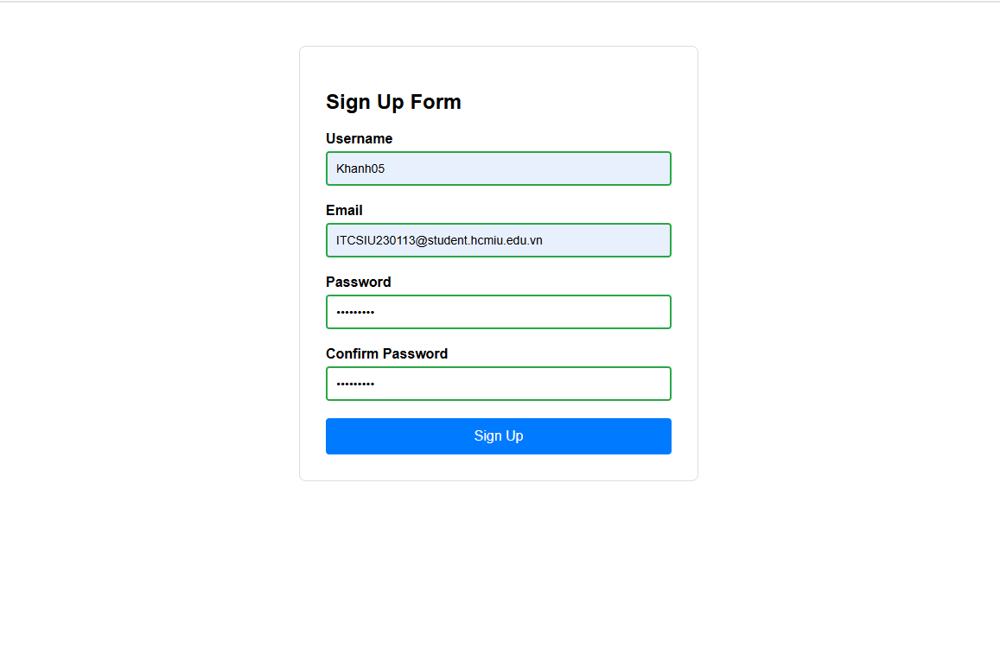

# Form Validator Exercise

This exercise implements a client-side form validation system using HTML, CSS, and JavaScript. The form includes real-time validation for user input with immediate feedback.

## Screenshots

### Form Validator Interface

### Email Validation Example

### Password and validate passoword match

## Features

- Real-time form validation
- Visual feedback with color-coded inputs
- Detailed error messages
- Accessibility support with ARIA attributes

## Form Fields

1. **Username**
   - Must be 4-20 characters long
   - Only alphanumeric characters allowed
   - Real-time validation on input

2. **Email**
   - Must be a valid email format (example@domain.com)
   - Validates email structure in real-time

3. **Password**
   - Minimum 8 characters
   - Must contain at least:
     - One uppercase letter
     - One number
   - Real-time strength validation

4. **Confirm Password**
   - Must match the password field
   - Updates validation in real-time

## Validation Features

- Empty field handling: removes error states when fields are cleared
- Real-time validation: validates as user types
- Visual indicators:
  - Red border for invalid input
  - Green border for valid input
  - Error messages appear below invalid fields
- Submit button:
  - Disabled until all fields are valid
  - Enables automatically when form is valid

## How to Use

1. Open `Form-Validator.html` in a web browser
2. Try entering different values in the form fields
3. Notice real-time validation feedback
4. Submit button will enable only when all fields are valid
5. Form will show success message on valid submission

## Implementation Details

- Pure JavaScript implementation (no external libraries)
- CSS classes for visual feedback:
  - `.valid` for valid inputs
  - `.invalid` for invalid inputs
  - `.error-message` for error display
- ARIA attributes for accessibility
- Event listeners for real-time validation
