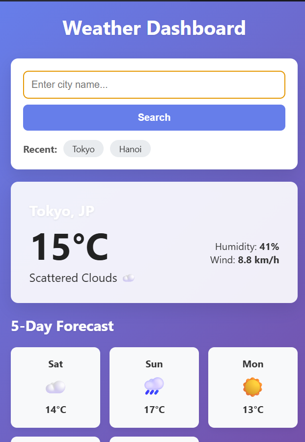
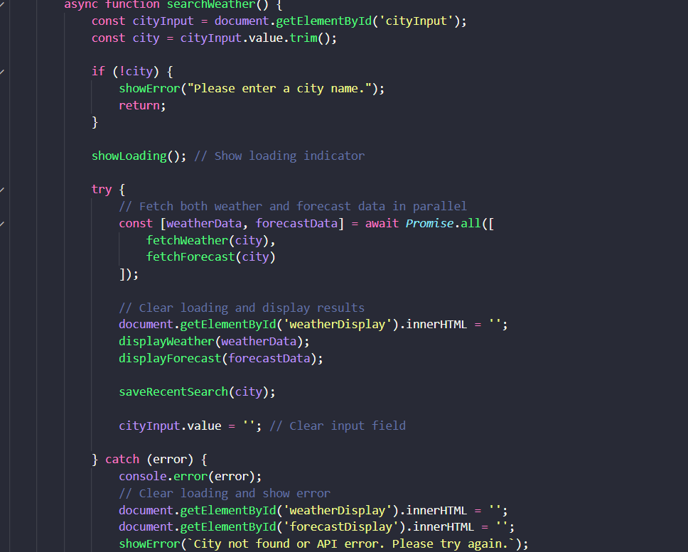
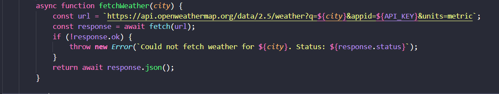
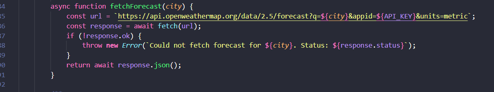
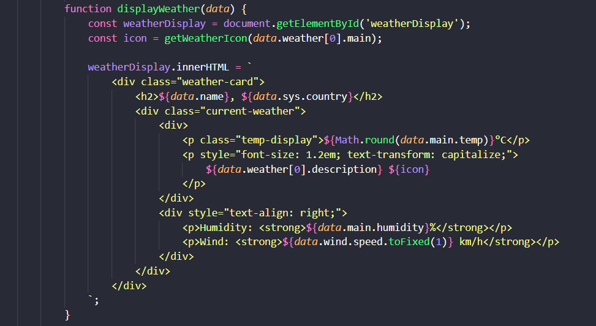
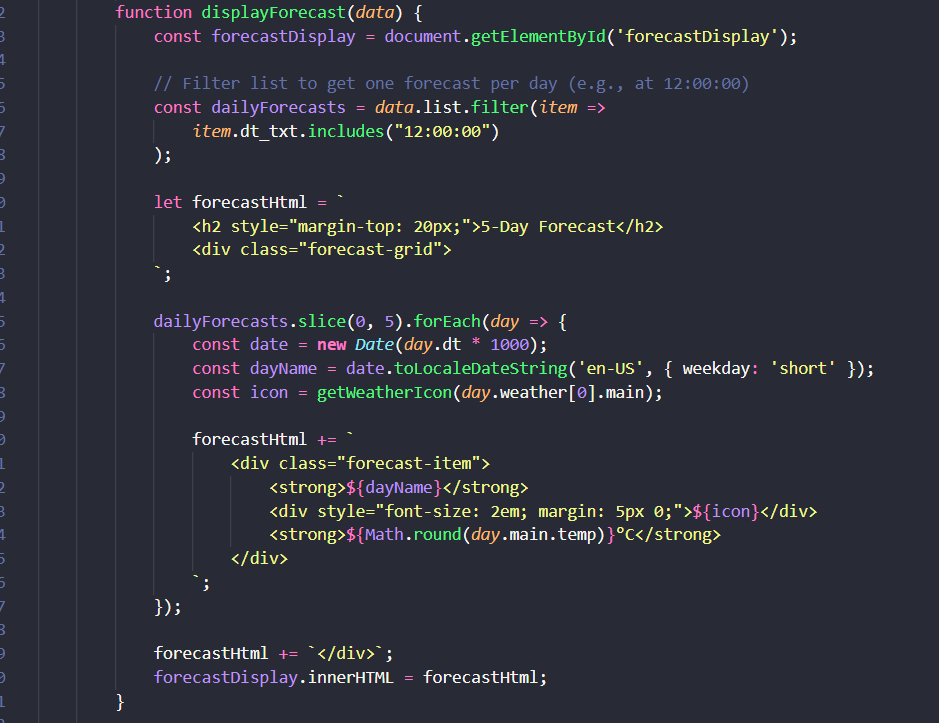
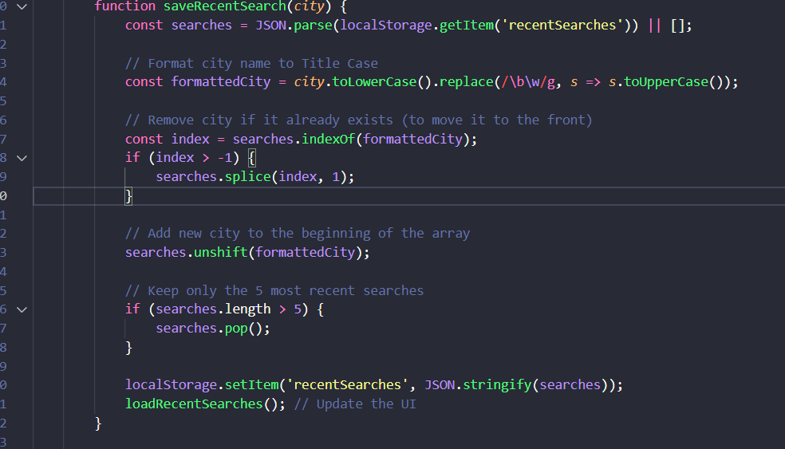

## Task 2.1: Weather Dashboard (15 points)

## 🎯 Real-World Application
Weather apps on your phone, weather widgets on news sites, smart home displays - they all fetch real-time data from weather APIs. Companies like The Weather Channel and AccuWeather serve billions of API requests daily. In this task, you'll build a professional weather dashboard that fetches real data from a weather API.

Results

## 🧠 JavaScript Logic

### Search Weather

- Handle when user click enter or right click on the search button whehter the name of city correct or not then present the error

- If city is valid simultaneously call api of forecast and weather in paralel

### Fetch Weather and Fetch Forecast

- Call api and receive data in the envelope under name response so we need transform response to json file.

### Display Weather and Forecase

- When we get the data add the data into the html structure by using innerHTML

### Save & Load Recent Search

- Store my recent in json format name recentSearches and store in the user hard drive when browrse need to retrived data come to that place.