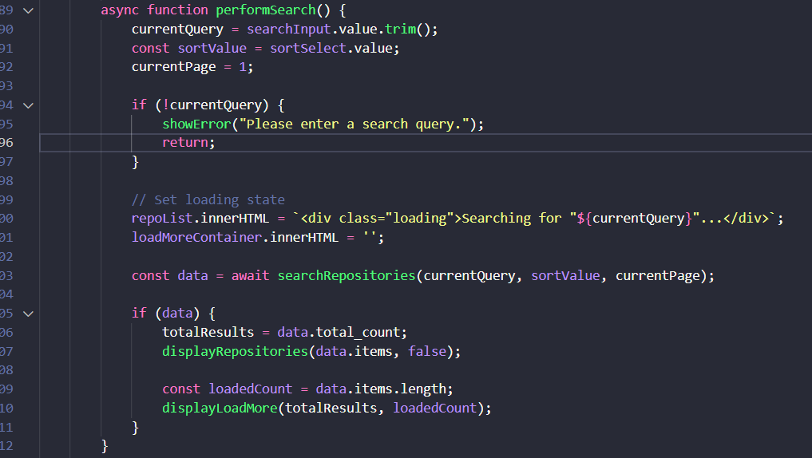
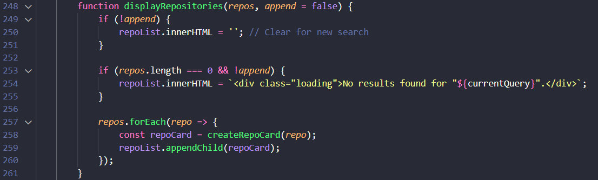
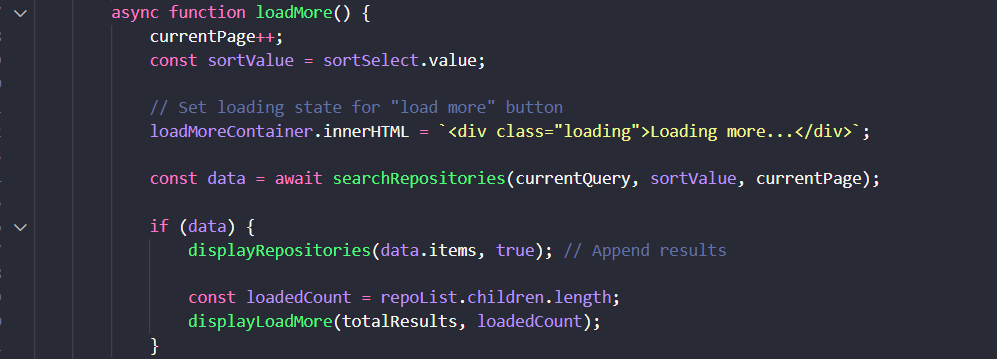

## Task 2.2: GitHub Repository Finder (15 points)

## 🎯 Real-World Application
Developer tools, code review platforms, and portfolio sites all integrate with GitHub's API to display repository information. Sites like GitExplorer, GitHub trending pages, and developer portfolios use the GitHub API to showcase projects.

## Results

### 🧠 JavaScript Logic

### Perform Search

- The same to exercise 2.1, handle when user click enter or right click on the search button whehter the name of city correct or not then present the error

- Then call api of github repository return data

### Display Repo

- The append parameter is a boolean flag (true/false) that tells the function whether to replace the results on the page or add to them.

### Load More

- If the display count lower than total results add the html of load more button.

- One click on load more button has just added to load more repo.