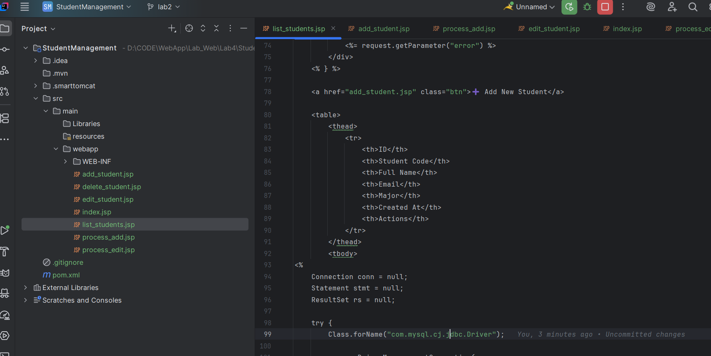
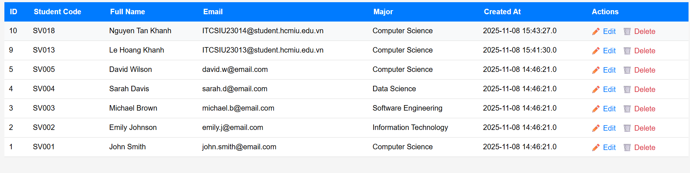
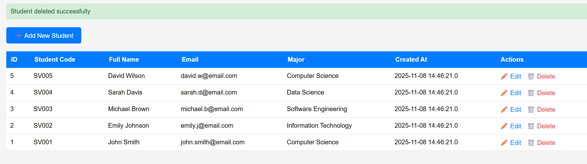

# LAB 4 EXERCISES: JSP + MYSQL - CRUD OPERATIONS

**Course:** Web Application Development  
**Lab Duration:** 2.5 hours  
**Total Points:** 100 points (In-class: 60 points, Homework: 40 points)

---

## 📚 BEFORE YOU START

### Pre-requisites:
- ✅ Completed environment setup (MySQL, NetBeans, Tomcat)
- ✅ Read the Setup Guide & Sample Code document
- ✅ Database `student_management` created with sample data
- ✅ MySQL Connector/J added to project

### Lab Objectives:
By the end of this lab, you should be able to:
1. Connect JSP pages to MySQL database using JDBC
2. Implement CRUD operations (Create, Read, Update, Delete)
3. Use PreparedStatement to prevent SQL injection
4. Handle form submissions and URL parameters
5. Implement basic validation and error handling

---

## PART A: IN-CLASS EXERCISES (60 points)

**Time Allocation:** 2.5 hours  
**Submission:** End of class session  
**Format:** Demonstrate working application to instructor

---

### EXERCISE 1: SETUP AND DISPLAY (15 points)

**Estimated Time:** 20 minutes

**Task 1.1: Project Setup (5 points)**

Create a new Web Application project:
1. Project name: `StudentManagement`
2. Add MySQL Connector/J library
3. Configure Tomcat server
4. Verify project builds without errors

**Deliverables:**
- ✅ Project created successfully
- ✅ Libraries added correctly
- ✅ Test build completes (Green checkmark in NetBeans)

**Result** 
---

**Task 1.2: Display Student List (10 points)**

Create `list_students.jsp` that displays all students in a table.

**Requirements:**
- Connect to database using JDBC
- Query all students from `students` table
- Display in HTML table with columns:
  - ID
  - Student Code
  - Full Name
  - Email
  - Major
  - Created At
- Handle database errors gracefully
- Close all database resources properly

**Evaluation Criteria:**
| Criteria | Points |
|----------|--------|
| Database connection successful | 2 |
| Query executes correctly | 2 |
| All data displayed in table | 3 |
| Proper error handling | 2 |
| Resources closed properly | 1 |

**Testing:**
- Run the page: `http://localhost:8080/StudentManagement/list_students.jsp`
- Should see 5 sample students
- No error messages displayed

**Result** 
---

### EXERCISE 2: CREATE OPERATION (15 points)

**Estimated Time:** 30 minutes

**Task 2.1: Create Add Student Form (5 points)**

Create `add_student.jsp` with a form to add new students.

**Requirements:**
- Form fields:
  - Student Code (text, required)
  - Full Name (text, required)
  - Email (email type, optional)
  - Major (text, optional)
- Submit button
- Cancel button (link back to list)
- Use POST method
- Basic HTML5 validation (required attribute)

**Evaluation Criteria:**
| Criteria | Points |
|----------|--------|
| Form displays correctly | 2 |
| All required fields present | 2 |
| Proper HTML attributes (required, type) | 1 |

**Result** 
---

**Task 2.2: Process Add Student (10 points)**

Create `process_add.jsp` to handle form submission.

**Requirements:**
- Retrieve form parameters using `request.getParameter()`
- Server-side validation:
  - Student code and full name are required
  - Display error if validation fails
- Insert data using PreparedStatement
- Handle duplicate student code error
- Redirect to list page on success with message
- Display error message on failure

**Evaluation Criteria:**
| Criteria | Points |
|----------|--------|
| Parameters retrieved correctly | 1 |
| Server-side validation implemented | 2 |
| PreparedStatement used (not Statement) | 3 |
| Successful insert redirects with message | 2 |
| Error handling implemented | 2 |

**Test Cases:**

| Test | Input | Expected Result |
|------|-------|----------------|
| Valid data | Code: SV006, Name: John Doe | Success, redirects to list |
| Empty required field | Code: (empty), Name: John | Error: "Required fields missing" |
| Duplicate code | Code: SV001 (existing) | Error: "Student code already exists" |

**Result** 
---

### EXERCISE 3: UPDATE OPERATION (15 points)

**Estimated Time:** 35 minutes

**Task 3.1: Create Edit Form (7 points)**

Create `edit_student.jsp` that displays a pre-filled form.

**Requirements:**
- Get student ID from URL parameter (`?id=1`)
- Query database for student with that ID
- Display form with pre-filled values
- Student code field should be readonly
- Handle case where student ID doesn't exist
- Include hidden input for student ID

**Evaluation Criteria:**
| Criteria | Points |
|----------|--------|
| ID parameter retrieved and validated | 2 |
| Student data queried correctly | 2 |
| Form pre-filled with current values | 2 |
| Student code is readonly | 1 |

**Result** 
---

**Task 3.2: Process Update (8 points)**

Create `process_edit.jsp` to handle update.

**Requirements:**
- Retrieve student ID and form data
- Validate inputs
- Update database using PreparedStatement
- Redirect to list on success
- Display error on failure

**Evaluation Criteria:**
| Criteria | Points |
|----------|--------|
| All parameters retrieved | 1 |
| UPDATE query with WHERE clause | 3 |
| PreparedStatement used correctly | 2 |
| Successful redirect with message | 1 |
| Error handling | 1 |

**Test Cases:**

| Test | Action | Expected Result |
|------|--------|----------------|
| Valid update | Change name from "John Smith" to "John Doe" | Success, list shows updated name |
| Invalid ID | Access edit page with id=999 | Error: "Student not found" |
| Empty name | Submit with blank name | Error: "Required field missing" |

**Result** 
---

### EXERCISE 4: DELETE OPERATION (15 points)

**Estimated Time:** 25 minutes

**Task 4.1: Implement Delete (10 points)**

Create `delete_student.jsp` to delete a student.

**Requirements:**
- Get student ID from URL parameter
- Delete record from database
- Redirect to list with message
- Handle errors (ID not found, database errors)

**Evaluation Criteria:**
| Criteria | Points |
|----------|--------|
| ID parameter validated | 2 |
| DELETE query executed | 3 |
| PreparedStatement used | 2 |
| Proper redirect with message | 2 |
| Error handling | 1 |

**Result** 
---

**Task 4.2: Add Delete Links and Confirmation (5 points)**

Modify `list_students.jsp` to add delete functionality.

**Requirements:**
- Add "Delete" link for each student in table
- Link format: `delete_student.jsp?id=[student_id]`
- Add JavaScript confirmation dialog
- Style delete link in red color

**Code Example:**
```jsp
<a href="delete_student.jsp?id=<%= student.getId() %>" 
   class="delete-link"
   onclick="return confirm('Are you sure you want to delete this student?')">
   Delete
</a>
```

**Evaluation Criteria:**
| Criteria | Points |
|----------|--------|
| Delete links added | 2 |
| Confirmation dialog works | 2 |
| Visual styling (red color) | 1 |

**Testing:**
- Click delete on test student
- Confirm in dialog → Student should be deleted
- Cancel in dialog → Student should remain

**Result** 
---

### DEMONSTRATION CHECKLIST (In-class)

At the end of class, demonstrate to instructor:

- [ ] **List Students:** Table displays all students
- [ ] **Add Student:** Successfully adds new student
- [ ] **Add Validation:** Shows error for empty required fields
- [ ] **Edit Student:** Form pre-fills with current data
- [ ] **Update Student:** Successfully updates information
- [ ] **Delete Student:** Successfully deletes with confirmation
- [ ] **Error Handling:** Properly handles invalid IDs
- [ ] **Code Quality:** Uses PreparedStatement, closes resources

**Grading Notes:**
- Full functionality: 50-60 points (Excellent)
- Most features work: 40-49 points (Good)
- Basic features only: 30-39 points (Satisfactory)
- Incomplete: <30 points (Needs improvement)

---

## PART B: HOMEWORK EXERCISES (40 points)

**Deadline:** Before next lab session (1 week)  
**Submission:** Upload to learning management system  
**Format:** ZIP file containing complete project

---

### EXERCISE 5: SEARCH FUNCTIONALITY (15 points)

**Estimated Time:** 45 minutes

Add search capability to find students by name or code.

**Requirements:**

**5.1: Create Search Form (3 points)**
- Add search form at top of `list_students.jsp`
- Input field for keyword
- Search button
- Method: GET (so search term appears in URL)

**HTML Structure:**
```html
<form action="list_students.jsp" method="GET">
    <input type="text" name="keyword" placeholder="Search by name or code...">
    <button type="submit">Search</button>
    <a href="list_students.jsp">Clear</a>
</form>
```

**5.2: Implement Search Logic (12 points)**

Modify `list_students.jsp` to handle search:

```java
// Pseudocode:
String keyword = request.getParameter("keyword");

if (keyword != null && !keyword.isEmpty()) {
    // Search query with LIKE operator
    sql = "SELECT * FROM students WHERE full_name LIKE ? OR student_code LIKE ?";
    pstmt = conn.prepareStatement(sql);
    pstmt.setString(1, "%" + keyword + "%");
    pstmt.setString(2, "%" + keyword + "%");
} else {
    // Normal query
    sql = "SELECT * FROM students ORDER BY id DESC";
}
```

**Evaluation Criteria:**

| Criteria | Points |
|----------|--------|
| Search form added correctly | 3 |
| LIKE operator used properly | 4 |
| Searches both name and code | 3 |
| Displays search results | 3 |
| "Clear" link works | 2 |

**Test Cases:**

| Search Term | Expected Results |
|-------------|------------------|
| "John" | Shows all students with "John" in name |
| "SV001" | Shows student with code SV001 |
| "science" | Shows students in Computer Science/Data Science |
| "" (empty) | Shows all students |

**Bonus (+2 points):** Highlight search term in results

---

### EXERCISE 6: VALIDATION ENHANCEMENT (10 points)

**Estimated Time:** 30 minutes

Improve validation for better data quality.

**6.1: Email Validation (5 points)**

Add email format validation in `process_add.jsp` and `process_edit.jsp`:

**Requirements:**
- Check if email is provided
- If provided, validate format using regex
- Regex pattern: `^[A-Za-z0-9+_.-]+@(.+)$`
- Display error if invalid

**Java Code:**
```java
String email = request.getParameter("email");
if (email != null && !email.isEmpty()) {
    if (!email.matches("^[A-Za-z0-9+_.-]+@(.+)$")) {
        // Invalid email format
        response.sendRedirect("add_student.jsp?error=Invalid email format");
        return;
    }
}
```

**Test Cases:**

| Email Input | Expected Result |
|-------------|----------------|
| john@email.com | Valid, accepts |
| john.doe@company.co.uk | Valid, accepts |
| john@email | Invalid, rejects |
| johnemail.com | Invalid, rejects |
| (empty) | Valid, accepts (optional field) |

---

**6.2: Student Code Pattern Validation (5 points)**

Validate student code follows pattern: 2 uppercase letters + 3+ digits

**Requirements:**
- Pattern: `[A-Z]{2}[0-9]{3,}`
- Examples: SV001, IT123, CS9999 (valid)
- Examples: sv001, S001, SV12 (invalid)
- Check in server-side code
- Display clear error message

**Evaluation Criteria:**

| Criteria | Points |
|----------|--------|
| Email validation regex correct | 3 |
| Error displayed for invalid email | 2 |
| Student code pattern validated | 3 |
| Error displayed for invalid code | 2 |

---

### EXERCISE 7: USER EXPERIENCE IMPROVEMENTS (15 points)

**Estimated Time:** 60 minutes

**7.1: Pagination (8 points)**

Add pagination to display 10 students per page.

**Requirements:**

**Database Query with LIMIT:**
```sql
SELECT * FROM students 
ORDER BY id DESC 
LIMIT ? OFFSET ?
```

**Calculate Pagination:**
```java
// Get page number from URL (default = 1)
String pageParam = request.getParameter("page");
int currentPage = (pageParam != null) ? Integer.parseInt(pageParam) : 1;

// Records per page
int recordsPerPage = 10;

// Calculate offset
int offset = (currentPage - 1) * recordsPerPage;

// Get total records for pagination
int totalRecords = getTotalRecords(); // You need to implement this
int totalPages = (int) Math.ceil((double) totalRecords / recordsPerPage);
```

**Display Pagination Links:**
```html
<div class="pagination">
    <% if (currentPage > 1) { %>
        <a href="list_students.jsp?page=<%= currentPage - 1 %>">Previous</a>
    <% } %>
    
    <% for (int i = 1; i <= totalPages; i++) { %>
        <% if (i == currentPage) { %>
            <strong><%= i %></strong>
        <% } else { %>
            <a href="list_students.jsp?page=<%= i %>"><%= i %></a>
        <% } %>
    <% } %>
    
    <% if (currentPage < totalPages) { %>
        <a href="list_students.jsp?page=<%= currentPage + 1 %>">Next</a>
    <% } %>
</div>
```

**Evaluation Criteria:**

| Criteria | Points |
|----------|--------|
| LIMIT/OFFSET query implemented | 3 |
| Page number from URL parameter | 2 |
| Total pages calculated correctly | 2 |
| Pagination links display | 1 |

---

**7.2: Improved UI/UX (7 points)**

Enhance the visual design and user experience.

**Requirements:**

a) **Success/Error Message Styling (2 points)**
- Add distinct colors (green for success, red for error)
- Add icons (✓ for success, ✗ for error)
- Auto-hide after 3 seconds (JavaScript)

```javascript
<script>
setTimeout(function() {
    var messages = document.querySelectorAll('.message');
    messages.forEach(function(msg) {
        msg.style.display = 'none';
    });
}, 3000);
</script>
```

b) **Loading States (2 points)**
- Disable submit button after clicking to prevent double submission
- Show "Processing..." text

```javascript
<script>
function submitForm(form) {
    var btn = form.querySelector('button[type="submit"]');
    btn.disabled = true;
    btn.textContent = 'Processing...';
    return true;
}
</script>

<form onsubmit="return submitForm(this)">
```

c) **Responsive Table (3 points)**
- Table scrollable on small screens
- Better mobile layout

```css
.table-responsive {
    overflow-x: auto;
}

@media (max-width: 768px) {
    table {
        font-size: 12px;
    }
    th, td {
        padding: 5px;
    }
}
```

**Evaluation Criteria:**

| Criteria | Points |
|----------|--------|
| Message styling improved | 2 |
| Button loading state | 2 |
| Responsive design | 3 |

---

### BONUS EXERCISES (Optional - Extra Credit)

**Not required, but can earn up to 10 bonus points**

---

**BONUS 1: Export to CSV (5 points)**

Add functionality to export student list to CSV file.

**Hint:** Create `export_csv.jsp`:
```jsp
<%
response.setContentType("text/csv");
response.setHeader("Content-Disposition", "attachment; filename=\"students.csv\"");

out.println("ID,Student Code,Full Name,Email,Major");

// Query and loop through students
while (rs.next()) {
    out.println(rs.getInt("id") + "," + 
                rs.getString("student_code") + "," +
                rs.getString("full_name") + "," +
                rs.getString("email") + "," +
                rs.getString("major"));
}
%>
```

---

**BONUS 2: Sort by Column (5 points)**

Add ability to sort table by clicking column headers.

**Requirements:**
- Click "Full Name" header → sort alphabetically
- Click "Created At" → sort by date
- Toggle ascending/descending

**Hint:**
```java
String sortBy = request.getParameter("sort"); // column name
String order = request.getParameter("order"); // asc or desc

if (sortBy == null) sortBy = "id";
if (order == null) order = "desc";

String sql = "SELECT * FROM students ORDER BY " + sortBy + " " + order;
```

---

**BONUS 3: Bulk Delete (5 points)**

Add checkboxes to select multiple students and delete them at once.

**Requirements:**
- Checkbox for each student row
- "Select All" checkbox
- "Delete Selected" button
- Confirmation before bulk delete

---

## HOMEWORK SUBMISSION GUIDELINES

### What to Submit:

**1. Complete Project ZIP File:**
```
StudentManagement.zip
├── src/ (if any Java files)
├── web/
│   ├── list_students.jsp
│   ├── add_student.jsp
│   ├── process_add.jsp
│   ├── edit_student.jsp
│   ├── process_edit.jsp
│   └── delete_student.jsp
├── nbproject/
└── README.txt (see below)
```

**2. README.txt File:**
```
STUDENT INFORMATION:
Name: [Your Name]
Student ID: [Your ID]
Class: [Your Class]

COMPLETED EXERCISES:
[x] Exercise 5: Search Functionality
[x] Exercise 6: Validation Enhancement
[x] Exercise 7: Pagination
[ ] Bonus 1: CSV Export
[ ] Bonus 2: Sortable Columns

KNOWN ISSUES:
- [List any bugs or incomplete features]

EXTRA FEATURES:
- [List any additional features you added]

TIME SPENT: [Approximate hours]

REFERENCES USED:
- [List any websites, tutorials, or resources you used]
```

**3. Screenshots (5-10 images):**
- Main list page
- Add student form
- Edit student form
- Search results
- Validation errors
- Pagination (if implemented)

### Grading Rubric:

| Category | Points | Criteria |
|----------|--------|----------|
| **Functionality** | 25 | All required features work correctly |
| **Code Quality** | 8 | Clean code, proper naming, comments |
| **Error Handling** | 4 | Validates input, handles errors gracefully |
| **Documentation** | 3 | README file complete and clear |

**Total Homework Points: 40**  
**Bonus Points: Up to 10**

---

## COMMON MISTAKES TO AVOID

### ❌ Don't Do This:

**1. Using Statement instead of PreparedStatement:**
```java
// ❌ BAD - SQL Injection vulnerability!
String sql = "INSERT INTO students VALUES ('" + code + "', '" + name + "')";
Statement stmt = conn.createStatement();
stmt.executeUpdate(sql);
```

**2. Forgetting WHERE Clause:**
```java
// ❌ BAD - Deletes ALL students!
String sql = "DELETE FROM students";
```

**3. Not Closing Resources:**
```java
// ❌ BAD - Memory leak!
Connection conn = getConnection();
Statement stmt = conn.createStatement();
// ... use them ...
// Forgot to close!
```

**4. Trusting Client Validation Only:**
```html
<!-- ❌ This can be bypassed! -->
<input type="text" required>
<!-- Need server validation too -->
```

### ✅ Do This Instead:

**1. Always Use PreparedStatement:**
```java
String sql = "INSERT INTO students VALUES (?, ?)";
PreparedStatement pstmt = conn.prepareStatement(sql);
pstmt.setString(1, code);
pstmt.setString(2, name);
```

**2. Always Include WHERE:**
```java
String sql = "DELETE FROM students WHERE id = ?";
pstmt.setInt(1, studentId);
```

**3. Close in Finally Block:**
```java
try {
    // database operations
} finally {
    if (rs != null) rs.close();
    if (stmt != null) stmt.close();
    if (conn != null) conn.close();
}
```

**4. Validate on Server:**
```java
if (name == null || name.trim().isEmpty()) {
    response.sendRedirect("error.jsp");
    return;
}
```

---

## TROUBLESHOOTING GUIDE

### Problem 1: "ClassNotFoundException: com.mysql.cj.jdbc.Driver"

**Solution:**
- Right-click project → Properties → Libraries
- Click "Add JAR/Folder"
- Add `mysql-connector-java-8.0.33.jar`
- Clean and rebuild project

---

### Problem 2: "SQLException: Access denied for user 'root'@'localhost'"

**Solution:**
- Check MySQL username and password
- Verify MySQL server is running
- Try resetting MySQL root password

---

### Problem 3: "404 - Page Not Found"

**Solution:**
- Check file name spelling (case-sensitive on some systems)
- Verify file is in correct location (Web Pages folder)
- Clean and rebuild project
- Restart Tomcat server

---

### Problem 4: Parameters are null

**Solution:**
- Check form field `name` attribute matches `request.getParameter("name")`
- Verify form method is POST (for process pages)
- Check URL parameters are properly formatted

Example:
```html
<!-- HTML Form -->
<input name="student_code" ...>

<!-- JSP Processing -->
String code = request.getParameter("student_code"); // Must match!
```

---

### Problem 5: Data not displaying in table

**Solution:**
- Check SQL query syntax
- Verify table and column names
- Print ResultSet to console for debugging:
```java
while (rs.next()) {
    System.out.println(rs.getString("full_name")); // Debug output
}
```

---

## RESOURCES

### Official Documentation:
- **JDBC Tutorial:** https://docs.oracle.com/javase/tutorial/jdbc/
- **JSP Syntax:** https://docs.oracle.com/javaee/5/tutorial/doc/bnagx.html
- **MySQL Reference:** https://dev.mysql.com/doc/refman/8.0/en/

### Useful Tutorials:
- **W3Schools SQL:** https://www.w3schools.com/sql/
- **PreparedStatement Examples:** https://www.javatpoint.com/PreparedStatement-interface

### Debugging Tools:
- **NetBeans Debugger:** Set breakpoints, inspect variables
- **Browser DevTools:** F12 → Network tab for request/response
- **MySQL Workbench:** Test queries before using in JSP

---

## FAQ (Frequently Asked Questions)

**Q1: Can I use different table/column names?**  
A: Yes, but make sure to update all queries accordingly.

**Q2: Is it okay to use Statement for simple SELECT queries?**  
A: Technically yes if there's no user input, but PreparedStatement is always recommended as best practice.

**Q3: Should I validate empty strings or NULL?**  
A: Check for both: `if (name == null || name.trim().isEmpty())`

**Q4: How do I handle optional fields (like email)?**  
A: Check if null before validation:
```java
if (email != null && !email.isEmpty()) {
    // Validate email format
}
```

**Q5: Can I use try-with-resources instead of finally?**  
A: Yes! It's actually better:
```java
try (Connection conn = getConnection();
     PreparedStatement pstmt = conn.prepareStatement(sql)) {
    // Use resources
} // Auto-closed
```

**Q6: What's the difference between forward and redirect?**  
A: 
- `forward`: Server-side, same request, URL doesn't change
- `redirect`: Client-side, new request, URL changes

Use redirect after POST to prevent duplicate submissions.

---

## EVALUATION SUMMARY

### In-Class Work (60 points):
- Exercise 1: Setup and Display (15 points)
- Exercise 2: Create Operation (15 points)
- Exercise 3: Update Operation (15 points)
- Exercise 4: Delete Operation (15 points)

### Homework (40 points):
- Exercise 5: Search Functionality (15 points)
- Exercise 6: Validation Enhancement (10 points)
- Exercise 7: User Experience (15 points)

### Bonus (10 points):
- CSV Export (5 points)
- Sorting (5 points)
- Bulk Delete (5 points)

**Total Possible: 110 points (including bonus)**

---

## NEED HELP?

**During Lab:**
- Raise your hand for instructor assistance
- Ask classmates (collaboration is encouraged for learning)

**Outside Lab:**
- Email instructor with specific questions
- Post on class discussion forum
- Office hours: [Your schedule here]

**When Asking for Help, Provide:**
1. What you're trying to do
2. What you've tried
3. Error messages (screenshot or copy-paste)
4. Relevant code snippet

---

**Good luck with your lab exercises! 🚀**

*Remember: The goal is to learn, not just to complete. Take time to understand each concept!*