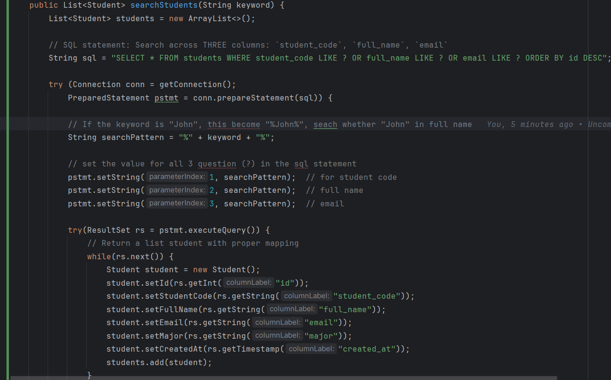
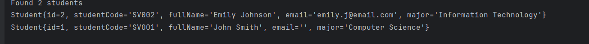
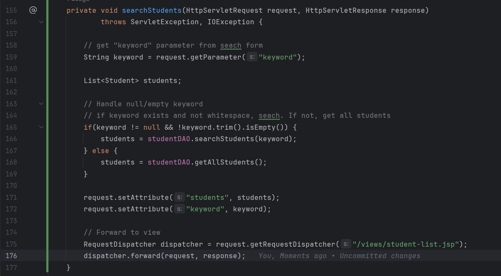
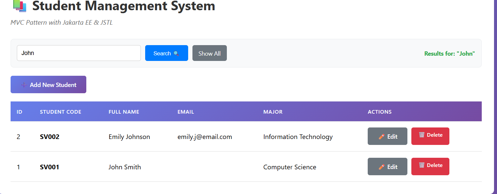
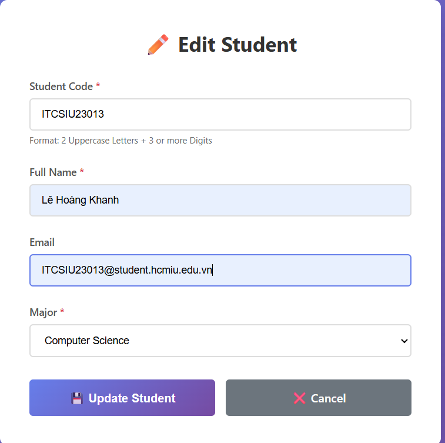
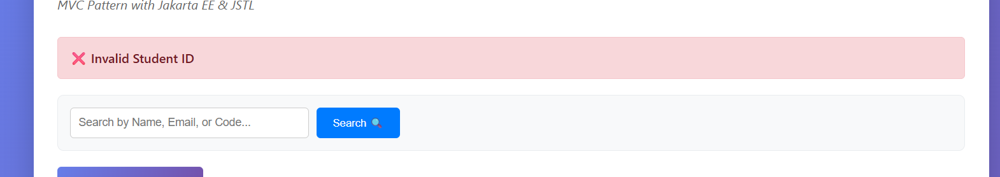
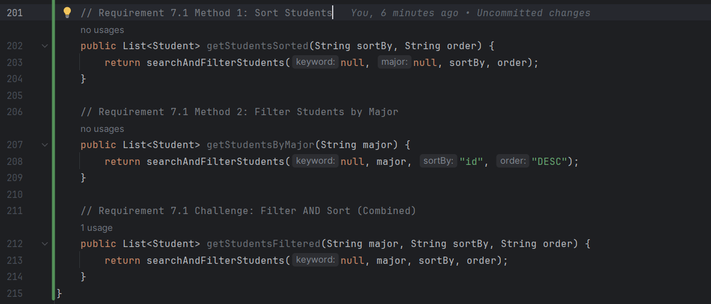
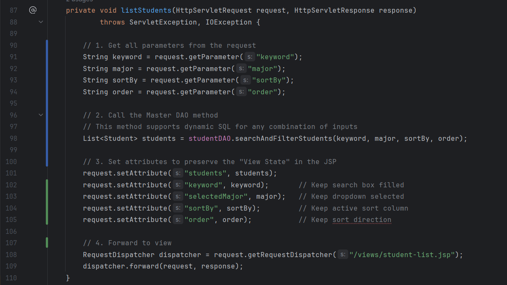

---
title: 'LAB 5 EXERCISES: SERVLET & MVC PATTERN'

---

# LAB 5 EXERCISES: SERVLET & MVC PATTERN

**Course:** Web Application Development  
**Lab Duration:** 2.5 hours  
**Total Points:** 100 points (In-class: 60 points, Homework: 40 points)

---

## PART A: IN-CLASS EXERCISES (60 points)

**Estimated Time:** 25 minutes

#### Task 1.1: Create Project Structure (5 points)

- Create proper MVC folder structure:


---

#### Task 1.2: Create Student JavaBean (5 points)

**File:** `src/main/java/com/student/Student.java`


---

#### Task 1.3: Create StudentDAO (5 points)

**File:** `src/main/java/com/student/StudentDAO.java`

**Checkpoint #1:** Show instructor that Student model and DAO work correctly.


---

### EXERCISE 2: CONTROLLER LAYER (20 points)

**Estimated Time:** 40 minutes

#### Task 2.1: Create Basic Servlet (10 points)

**File:** `src/main/java/com/student/controller/StudentController.java

---

#### Task 2.2: Add More CRUD Methods (10 points)

**Checkpoint #2:** Show instructor that all controller methods work.

**1.init()**
- Purpose: Initialize the servlet and create DAO instance
- Workflow: Server calls init() once -> Create studentDAO object -> Stored for all request

**2.doGet(...)**
- Purpose: Route HTTP GET requests to appropriate handler methods
- Workflow:Extract action parameter → Default to "list" if null → Switch on action
-> corresponding method (listStudents, showNewForm, showEditForm, or deleteStudent)

**3.doPost(...)**
- Purpose: Route HTTP POST requests (form submissions) to create/update handlers
- Workflow: Extract action parameter from POST body → Switch on action → Call insertStudent() or updateStudent()

**4.listStudents(...)**
- Purpose: Fetch all students from database and display list view
- Workflow: Get all students from DAO → Store in request attribute → Forward to student-list.jsp → JSP displays table

**5.showNewForm(...)**
- Purpose: Display empty form for adding new student
- Workflow: Forward request to student-form.jsp → JSP detects no student attribute → Display empty form

**6.showEditForm()**
- Purpose: Display pre-filled form for editing student
- Workflow: Extract student ID from request → Load student from DAO 
→ Set as request attribute → Forward to student-form.jsp → JSP displays pre-filled form

**7.insertStudent(...)**
- Purpose: Save new student data to database
- Workflow: Extract form fields → Create Student object → Call DAO.addStudent() 
→ Redirect to list with success/error message

**8.updateStudent(...)**
- Purpose: Save updated student data to database
- Workflow: Extract ID and form fields → Create Student object 
- → Set ID → Call DAO.updateStudent() → Redirect to list with success/error message

**9.deleteStudent(...)**
- Purpose: Delete student from database
- Workflow: Extract student ID → Call DAO.deleteStudent() → Redirect to list with success/error message


---

### EXERCISE 3: VIEW LAYER WITH JSTL (15 points)s

**Estimated Time:** 35 minutes

#### Task 3.1: Create Student List View (8 points)

#### Task 3.2: Create Student Form View (7 points)

**Checkpoint #3:** Show instructor complete MVC application working.

---

### EXERCISE 4: COMPLETE CRUD OPERATIONS (10 points)

**Estimated Time:** 20 minutes

#### Task 4.1: Complete DAO Methods (5 points)

---

#### Task 4.2: Integration Testing (5 points)

**Test Sequence:**

1. **List:** Navigate to `/student` - should see existing students
 

2. **Add:** Click "Add New Student": 
    - Fill form with test data 
    
    - Submit
    - Should redirect to list with success message 
    

3. **Edit:** Click "Edit" on test student
    - Form should pre-fill  
    
    - Modify data
    - Submit                
    
    - Should redirect with update message
4. **Delete:** Click "Delete" on test student
    - Should confirm
    - Should redirect with delete message 
    
5. **Empty State:** Delete all students
    - Should show "No students found" message

---

## PART B: HOMEWORK EXERCISES (40 points)

---


### EXERCISE 5: SEARCH FUNCTIONALITY (12 points)

**Objective:** Add search capability to find students by name, code, or email.

---

#### 5.1: Update StudentDAO (4 points)

**Task:** Add `searchStudents(String keyword)` method to `StudentDAO.java`

**Code:** 

**Result:** 


---

#### 5.2: Add Search Controller Method (4 points)

**Task:** Add search handling to `StudentController.java`

**Code:**

**Result:**


---

#### 5.3: Update Student List View (4 points)

**Task:** Add search form to `student-list.jsp

**Code:**

**Result:**


---

### EXERCISE 6: SERVER-SIDE VALIDATION (10 points)

**Objective:** Add server-side validation to prevent invalid data entry.

---

#### 6.1: Create Validation Method (5 points)

**Task:** Add `validateStudent()` method to `StudentController.java`

**Code:**
```java
private boolean validateStudent(Student student, HttpServletRequest request) {
        boolean isValid = true;

        // Validate Student code
        String code = student.getStudentCode();
        String codePattern = "[A-Z]{2}[0-9]{3,}";

        if(code == null || code.trim().isEmpty()) {
            request.setAttribute("errorCode", "Student Code is required");
            isValid = false;
        } else if(!code.matches(codePattern)) {
            request.setAttribute("errorCode", "Invalid format. Use 2 UPPERCASE letters + 3 or more digits (e.g., SV001)");
            isValid = false;
        }

        // Validate Full name
        String name = student.getFullName();
        if (name == null || name.trim().isEmpty()) {
            request.setAttribute("errorName", "Full name is required");
            isValid = false;
        } else if(name.trim().length() < 2) {
            request.setAttribute("errorName", "Name must be at least 2 characters");
            isValid = false;
        }

        // Validate email (only if provided)
        String email = student.getEmail();
        String emailPattern = "^[A-Za-z0-9+_.-]+@(.+)$";

        if(email != null && !email.trim().isEmpty()) {
            if (!email.matches(emailPattern)) {
                request.setAttribute("errorEmail", "Invalid email format");
                isValid = false;
            }
        }

        // Validate major
        String major = student.getMajor();
        if(major == null || major.trim().isEmpty()) {
            request.setAttribute("errorMajor", "Major is required");
            isValid = false;
        }

        return isValid;
    }
```

---

#### 6.2: Integrate Validation into Insert/Update (3 points)

**Task:** Use validation in `insertStudent()` and `updateStudent()` methods

**Code:**

``` java
private void insertStudent(HttpServletRequest request, HttpServletResponse response)
            throws ServletException, IOException {

        String studentCode = request.getParameter("studentCode");
        String fullName = request.getParameter("fullName");
        String email = request.getParameter("email");
        String major = request.getParameter("major");

        Student newStudent = new Student(studentCode, fullName, email, major);

        // Validate
        if (!validateStudent(newStudent, request)) {
            // 1. Preserve input data so the user doesn't have to re-type
            request.setAttribute("student", newStudent);

            // 2. Forward back to the form to show errors
            RequestDispatcher dispatcher = request.getRequestDispatcher("/views/student-form.jsp");
            dispatcher.forward(request, response);

            // 3. STOP execution here (do not save to DB)
            return;
        }

        // If valid, proceed with insert
        if (studentDAO.addStudent(newStudent)) {
            response.sendRedirect("student?action=list&message=Student added successfully");
        } else {
            response.sendRedirect("student?action=list&error=Failed to add student");
        }
    }

    private void updateStudent(HttpServletRequest request, HttpServletResponse response)
            throws ServletException, IOException {

        //  Get ID as string first
        String idStr = request.getParameter("id");
        int id = 0;

        try {
            // Try to parse the ID. If it is "" or null, this line will throw an error
            // and jump to the catch block instead of crashing the server.
            id = Integer.parseInt(idStr);
        } catch (NumberFormatException e) {
            // If ID is missing/invalid, redirect to list with error
            response.sendRedirect("student?action=list&error=Invalid Student ID");
            return;
        }

        // 2. Get other data
        String studentCode = request.getParameter("studentCode");
        String fullName = request.getParameter("fullName");
        String email = request.getParameter("email");
        String major = request.getParameter("major");

        Student student = new Student(studentCode, fullName, email, major);
        student.setId(id);

        // 3. Validate
        if (!validateStudent(student, request)) {
            // Preserve input data
            request.setAttribute("student", student);
            // Forward back to form
            RequestDispatcher dispatcher = request.getRequestDispatcher("/views/student-form.jsp");
            dispatcher.forward(request, response);
            return; // STOP execution
        }

        // 4. If valid, proceed with update
        if (studentDAO.updateStudent(student)) {
            response.sendRedirect("student?action=list&message=Student updated successfully");
        } else {
            response.sendRedirect("student?action=list&error=Failed to update student");
        }
    }
```

---

#### 6.3: Display Validation Errors in Form (2 points)

**Task:** Update `student-form.jsp` to show validation errors

**Code:**

**Result:**


---

### EXERCISE 7: SORTING & FILTERING (10 points)

**Objective:** Add ability to sort by columns and filter by major.

---

#### 7.1: Add Sort & Filter Methods to DAO (4 points)

**Task:** Add two new methods to `StudentDAO.java`

**Code:**



---

#### 7.2: Add Controller Methods (3 points)

**Task:** Add sorting and filtering to `StudentController.java`

**Code:**



---

#### 7.3: Update View with Sort & Filter UI (3 points)

**Task:** Add sorting and filtering controls to `student-list.jsp`