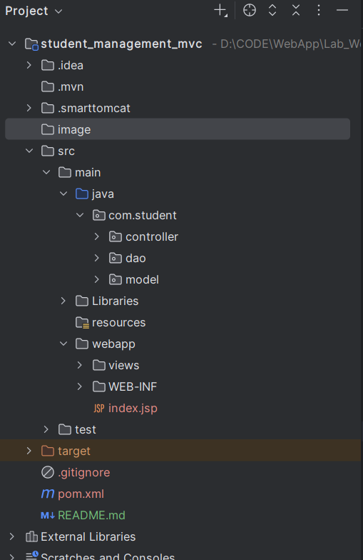
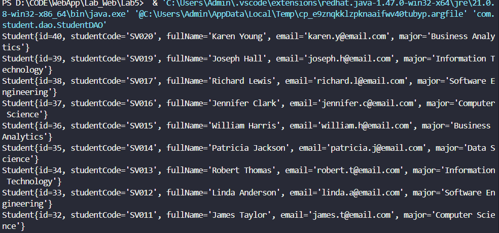
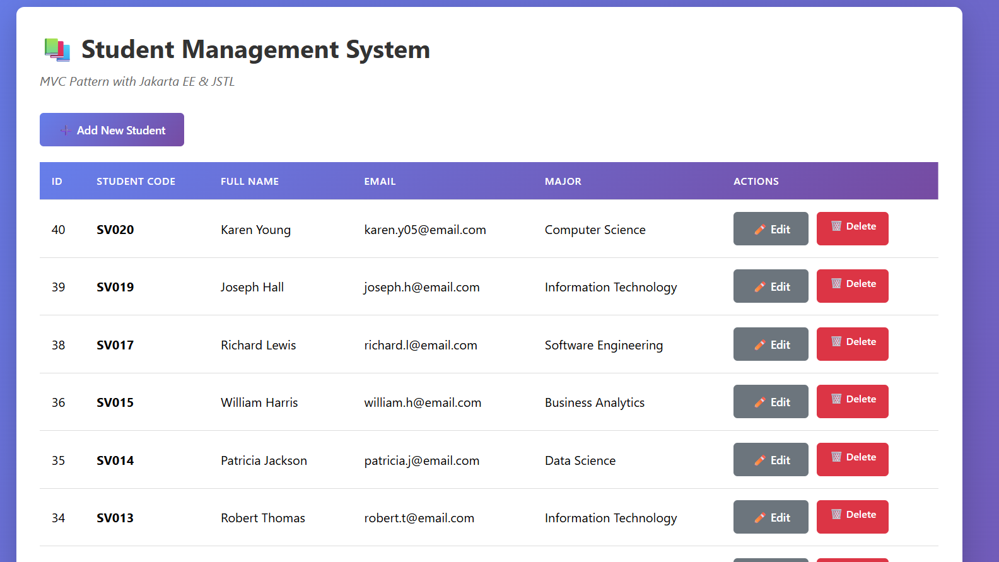
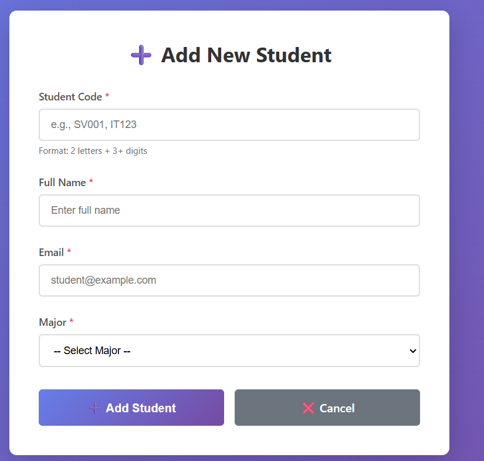
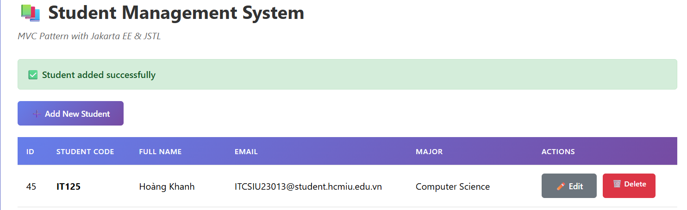
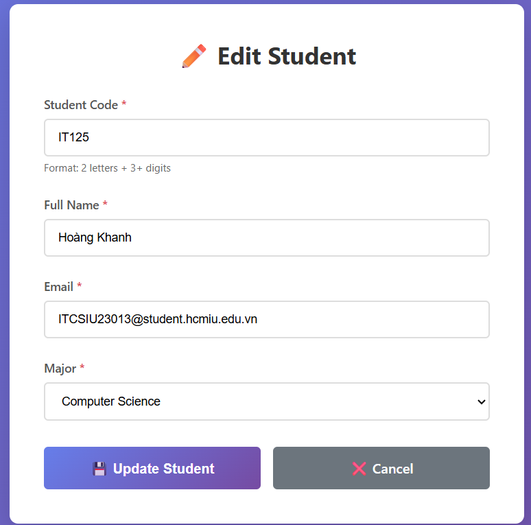
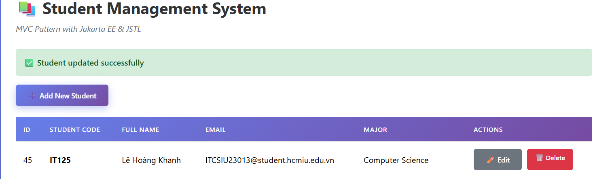
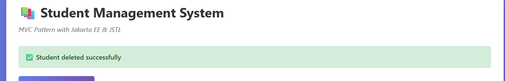

---
title: 'LAB 5 EXERCISES: SERVLET & MVC PATTERN'

---

# LAB 5 EXERCISES: SERVLET & MVC PATTERN

**Course:** Web Application Development  
**Lab Duration:** 2.5 hours  
**Total Points:** 100 points (In-class: 60 points, Homework: 40 points)

---

## PART A: IN-CLASS EXERCISES (60 points)

**Estimated Time:** 25 minutes

#### Task 1.1: Create Project Structure (5 points)

- Create proper MVC folder structure:

---

#### Task 1.2: Create Student JavaBean (5 points)

**File:** `src/main/java/com/student/Student.java`

---

#### Task 1.3: Create StudentDAO (5 points)

**File:** `src/main/java/com/student/StudentDAO.java`

**Checkpoint #1:** Show instructor that Student model and DAO work correctly.

---

### EXERCISE 2: CONTROLLER LAYER (20 points)

**Estimated Time:** 40 minutes

#### Task 2.1: Create Basic Servlet (10 points)

**File:** `src/main/java/com/student/controller/StudentController.java

---

#### Task 2.2: Add More CRUD Methods (10 points)

**Checkpoint #2:** Show instructor that all controller methods work.

**1.init()**
- Purpose: Initialize the servlet and create DAO instance
- Workflow: Server calls init() once -> Create studentDAO object -> Stored for all request

**2.doGet(...)**
- Purpose: Route HTTP GET requests to appropriate handler methods
- Workflow:Extract action parameter → Default to "list" if null → Switch on action
-> corresponding method (listStudents, showNewForm, showEditForm, or deleteStudent)

**3.doPost(...)**
- Purpose: Route HTTP POST requests (form submissions) to create/update handlers
- Workflow: Extract action parameter from POST body → Switch on action → Call insertStudent() or updateStudent()

**4.listStudents(...)**
- Purpose: Fetch all students from database and display list view
- Workflow: Get all students from DAO → Store in request attribute → Forward to student-list.jsp → JSP displays table

**5.showNewForm(...)**
- Purpose: Display empty form for adding new student
- Workflow: Forward request to student-form.jsp → JSP detects no student attribute → Display empty form

**6.showEditForm()**
- Purpose: Display pre-filled form for editing student
- Workflow: Extract student ID from request → Load student from DAO 
→ Set as request attribute → Forward to student-form.jsp → JSP displays pre-filled form

**7.insertStudent(...)**
- Purpose: Save new student data to database
- Workflow: Extract form fields → Create Student object → Call DAO.addStudent() 
→ Redirect to list with success/error message

**8.updateStudent(...)**
- Purpose: Save updated student data to database
- Workflow: Extract ID and form fields → Create Student object 
- → Set ID → Call DAO.updateStudent() → Redirect to list with success/error message

**9.deleteStudent(...)**
- Purpose: Delete student from database
- Workflow: Extract student ID → Call DAO.deleteStudent() → Redirect to list with success/error message

---

### EXERCISE 3: VIEW LAYER WITH JSTL (15 points)s

**Estimated Time:** 35 minutes

#### Task 3.1: Create Student List View (8 points)

#### Task 3.2: Create Student Form View (7 points)

**Checkpoint #3:** Show instructor complete MVC application working.

---

### EXERCISE 4: COMPLETE CRUD OPERATIONS (10 points)

**Estimated Time:** 20 minutes

#### Task 4.1: Complete DAO Methods (5 points)

---

#### Task 4.2: Integration Testing (5 points)

**Test Sequence:**

1. **List:** Navigate to `/student` - should see existing students
 

2. **Add:** Click "Add New Student": 
    - Fill form with test data 
    
    - Submit
    - Should redirect to list with success message 
    

3. **Edit:** Click "Edit" on test student
    - Form should pre-fill  
    
    - Modify data
    - Submit                
    
    - Should redirect with update message
4. **Delete:** Click "Delete" on test student
    - Should confirm
    - Should redirect with delete message 
    
5. **Empty State:** Delete all students
    - Should show "No students found" message