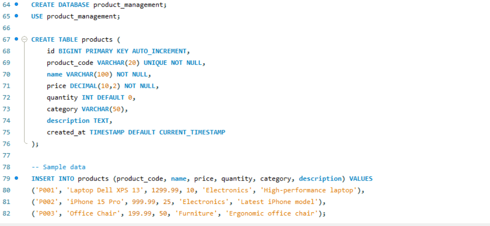
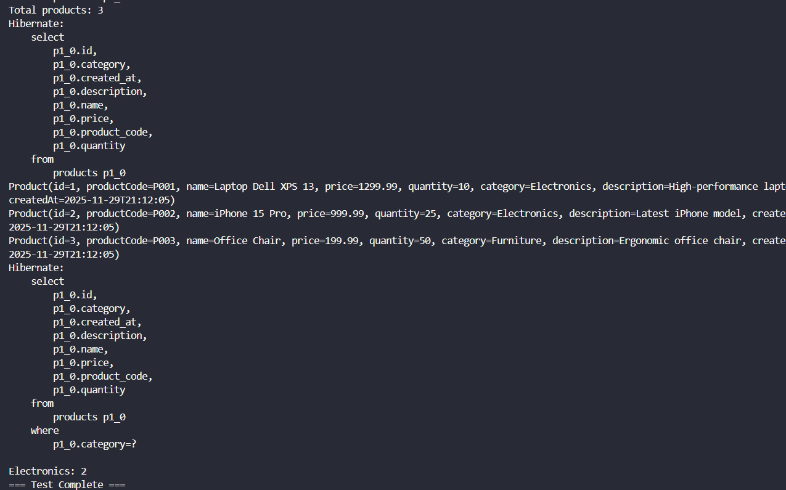
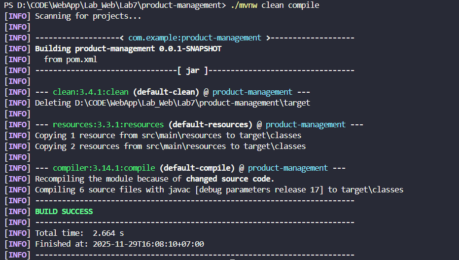
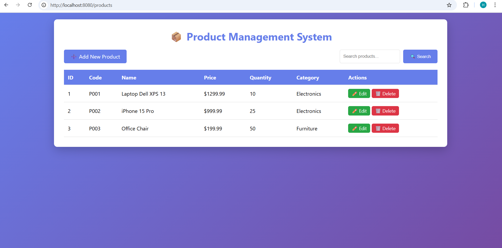
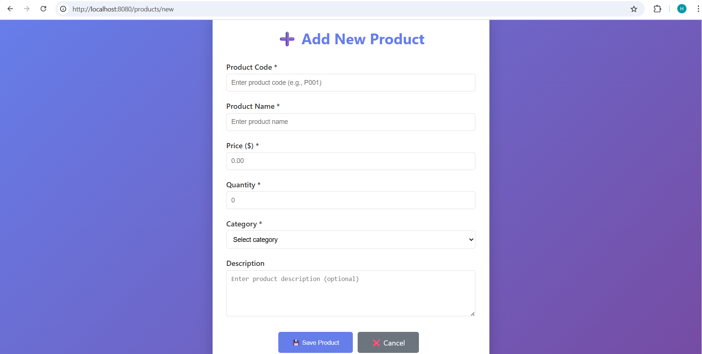
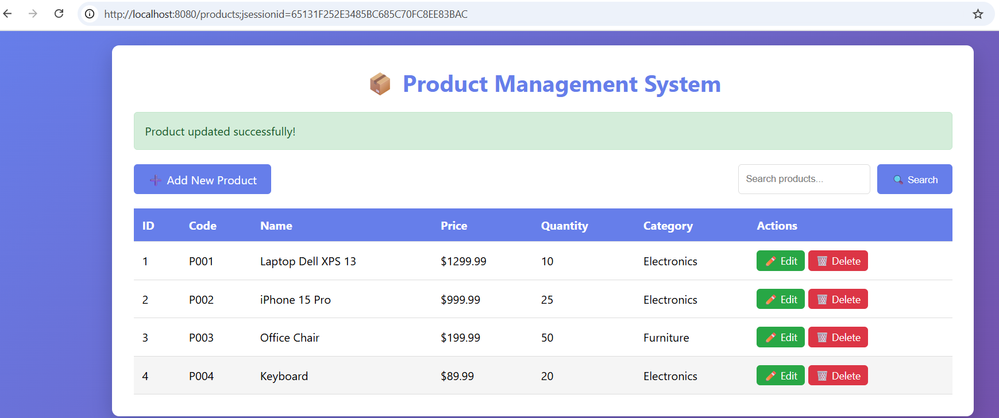
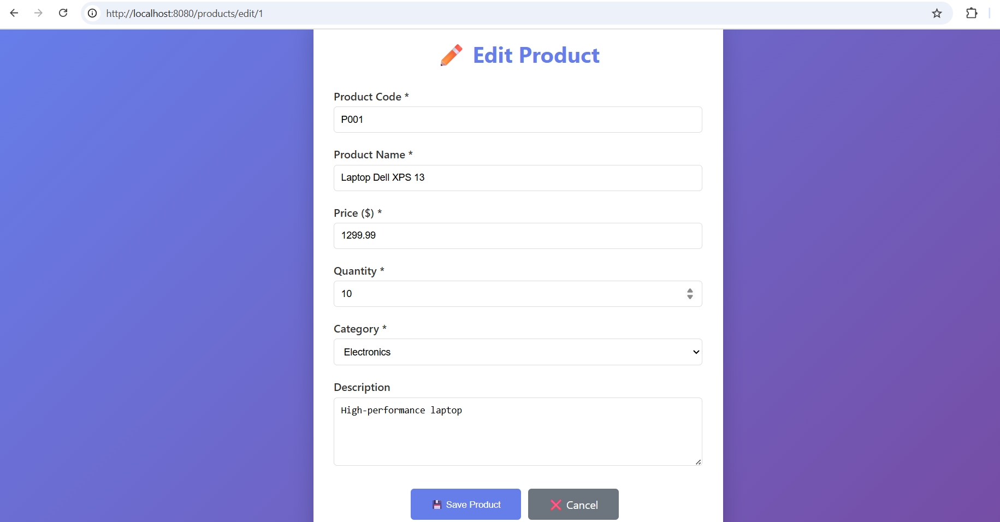

# title: 'LAB 6 [GUIDE]: AUTHENTICATION & SESSION MANAGEMENT'


**Course:** Web Application Development  
**Lab Duration:** 2.5 hours  
**Total Points:** 100 points (In-class: 60 points, Homework: 40 points)

> Name: Le Hoang Khanh
> ID: ITCSIU23013
> Tutor: Nguyen Trung Nghia

---
## PART A: IN-CLASS EXERCISES (60 points)

**Time Allocation:** 2.5 hours  
**Submission:** Demonstrate to instructor at end of

---

### EXERCISE 1: PROJECT SETUP & CONFIGURATION (15 points)

**Estimated Time:** 25 minutes

#### Task 1.1: Create Spring Boot Project (5 points)

**Using Spring Initializr in VS Code:**

1. Press `Ctrl+Shift+P`
2. Type: "Spring Initializr: Create a Maven Project"
3. Select configurations:
   - Spring Boot: **3.3.x** (latest stable)
   - Language: **Java**
   - Group Id: **com.example**
   - Artifact Id: **product-management**
   - Packaging: **Jar**
   - Java version: **17** or **21**

4. Add dependencies:
   - ✅ Spring Web
   - ✅ Spring Data JPA
   - ✅ MySQL Driver
   - ✅ Thymeleaf
   - ✅ Spring Boot DevTools (optional)

5. Choose folder and open project

**Evaluation Criteria:**
| Criteria | Points |
|----------|--------|
| Project created with correct structure | 2 |
| All dependencies added | 2 |
| Project opens without errors | 1 |

---

#### Task 1.2: Database Setup (5 points)

**Create Database and Table:**
 


```sql
CREATE DATABASE product_management;
USE product_management;

CREATE TABLE products (
    id BIGINT PRIMARY KEY AUTO_INCREMENT,
    product_code VARCHAR(20) UNIQUE NOT NULL,
    name VARCHAR(100) NOT NULL,
    price DECIMAL(10,2) NOT NULL,
    quantity INT DEFAULT 0,
    category VARCHAR(50),
    description TEXT,
    created_at TIMESTAMP DEFAULT CURRENT_TIMESTAMP
);

-- Insert sample data
INSERT INTO products (product_code, name, price, quantity, category, description) VALUES
('P001', 'Laptop Dell XPS 13', 1299.99, 10, 'Electronics', 'High-performance laptop with Intel i7'),
('P002', 'iPhone 15 Pro', 999.99, 25, 'Electronics', 'Latest iPhone with A17 Pro chip'),
('P003', 'Samsung Galaxy S24', 899.99, 20, 'Electronics', 'Flagship Android smartphone'),
('P004', 'Office Chair Ergonomic', 199.99, 50, 'Furniture', 'Comfortable office chair with lumbar support'),
('P005', 'Standing Desk', 399.99, 15, 'Furniture', 'Adjustable height standing desk');
```

**Evaluation Criteria:**
| Criteria | Points |
|----------|--------|
| Database created | 2 |
| Table structure correct | 2 |
| Sample data inserted | 1 |

---

#### Task 1.3: Configure application.properties (5 points)

**File:** `src/main/resources/application.properties`

**Template to complete:**
```properties
# Application Name
spring.application.name=product-management

# Server Port
server.port=8080

# Database Configuration
spring.datasource.url=jdbc:mysql://localhost:3306/product_management?useSSL=false&serverTimezone=UTC&allowPublicKeyRetrieval=true
spring.datasource.username=root
spring.datasource.password=Khanh2005@
spring.datasource.driver-class-name=com.mysql.cj.jdbc.Driver

# JPA/Hibernate Configuration
spring.jpa.hibernate.ddl-auto=update
spring.jpa.show-sql=true
spring.jpa.properties.hibernate.format_sql=true
spring.jpa.properties.hibernate.dialect=org.hibernate.dialect.MySQLDialect

# Thymeleaf Configuration
spring.thymeleaf.cache=false
spring.thymeleaf.prefix=classpath:/templates/
spring.thymeleaf.suffix=.html

# Logging
logging.level.org.springframework=INFO
logging.level.com.example.productmanagement=DEBUG

```

**Solution:**
```properties
spring.datasource.url=jdbc:mysql://localhost:3306/product_management?useSSL=false&serverTimezone=UTC&allowPublicKeyRetrieval=true
spring.datasource.username=root
spring.datasource.password=Khanh2005@
spring.datasource.driver-class-name=com.mysql.cj.jdbc.Driver

spring.jpa.hibernate.ddl-auto=update
spring.jpa.show-sql=true
spring.jpa.properties.hibernate.format_sql=true
spring.jpa.properties.hibernate.dialect=org.hibernate.dialect.MySQLDialect
```

**Evaluation Criteria:**
| Criteria | Points |
|----------|--------|
| Database connection configured | 2 |
| JPA properties set correctly | 2 |
| Application runs without errors | 1 |

**Checkpoint #1:** Run the application and verify no errors. Check console for successful connection.

#### How to check

* Location: src/main/resources/application.properties

---

### EXERCISE 2: ENTITY & REPOSITORY LAYERS (20 points)

**Estimated Time:** 40 minutes

#### Task 2.1: Create Product Entity (10 points)

**File:** `src/main/java/com/example/productmanagement/entity/Product.java`

**Requirements:**
- Add proper JPA annotations
- All fields with appropriate types
- Use BigDecimal for price
- Use LocalDateTime for timestamp
- Add lifecycle callback for createdAt
- Generate getters, setters, constructors

**Template to complete:**
```java
package com.example.product_management.entity;

import jakarta.persistence.*;
import lombok.*; // Import Lombok
import java.math.BigDecimal;
import java.time.LocalDateTime;

@Entity
@Table(name = "products")
@Data                 // Getters, Setters, toString, equals, and hashCode
@NoArgsConstructor    //  the empty constructor (Required by JPA)
@AllArgsConstructor   //  the constructor with all fields
public class Product {
    
    @Id
    @GeneratedValue(strategy = GenerationType.IDENTITY)
    private Long id;
    
    @Column(name = "product_code", unique = true, nullable = false, length = 20)
    private String productCode;
    
    @Column(nullable = false, length = 100)
    private String name;
    
    @Column(nullable = false, precision = 10, scale = 2)
    private BigDecimal price;
    
    @Column(nullable = false)
    private Integer quantity;
    
    @Column(length = 50)
    private String category;
    
    @Column(columnDefinition = "TEXT")
    private String description;
    
    @Column(name = "created_at", updatable = false)
    private LocalDateTime createdAt;

    // You still keep custom logic like this, Lombok doesn't replace it
    @PrePersist
    protected void onCreate() {
        this.createdAt = LocalDateTime.now();
    }
}
```

**Evaluation Criteria:**
| Criteria | Points |
|----------|--------|
| All JPA annotations correct | 3 |
| Proper data types used | 2 |
| Constructors implemented | 2 |
| Getters/setters complete | 2 |
| @PrePersist lifecycle callback | 1 |

---

#### Task 2.2: Create Product Repository (5 points)

**File:** `src/main/java/com/example/productmanagement/repository/ProductRepository.java`

**Requirements:**
- Interface extends JpaRepository
- Add @Repository annotation
- Add custom query methods

**Template to complete:**
```java
package com.example.productmanagement.repository;

import com.example.productmanagement.entity.Product;
import org.springframework.data.jpa.repository.JpaRepository;
import org.springframework.stereotype.Repository;

import java.math.BigDecimal;
import java.util.List;

// TODO: Add @Repository annotation
// TODO: Extend JpaRepository<Product, Long>
public interface ProductRepository {
    
    // TODO: Add method to find products by category
    
    // TODO: Add method to find products by name containing keyword
    
    // TODO: Add method to check if product code exists
    
    // Note: Basic CRUD methods are inherited from JpaRepository
}
```

**Solution:**
```java
package com.example.product_management.repository;

import org.springframework.data.jpa.repository.JpaRepository;
import org.springframework.stereotype.Repository;

import com.example.product_management.entity.Product;

import java.math.BigDecimal;
import java.util.List;

@Repository
public interface ProductRepository extends JpaRepository<Product, Long> {       // genetic type <Product, Long>
    
    // Spring Data JPA generates implementation automatically!
    
    // Custom query methods (derived from method names)
    List<Product> findByCategory(String category);
    
    List<Product> findByNameContaining(String keyword);
    
    List<Product> findByPriceBetween(BigDecimal minPrice, BigDecimal maxPrice);
    
    List<Product> findByCategoryOrderByPriceAsc(String category);
    
    boolean existsByProductCode(String productCode);
    
    // All basic CRUD methods inherited from JpaRepository:
    // - findAll()
    // - findById(Long id)
    // - save(Product product)
    // - deleteById(Long id)
    // - count()
    // - existsById(Long id)

    
}
```

**Evaluation Criteria:**
| Criteria | Points |
|----------|--------|
| Extends JpaRepository correctly | 2 |
| Custom query methods correct | 2 |
| Method naming conventions followed | 1 |

---

#### Task 2.3: Test Repository (5 points)

**Create a test in main application class (temporary):**

* 

```java
@SpringBootApplication
public class ProductManagementApplication {

    public static void main(String[] args) {
        SpringApplication.run(ProductManagementApplication.class, args);
    }
    
    // Temporary test - remove after verification
    @Bean
    CommandLineRunner test(ProductRepository repository) {
        return args -> {
            System.out.println("=== Testing Repository ===");
            
            // Count all products
            long count = repository.count();
            System.out.println("Total products: " + count);
            
            // Find all products
            List<Product> products = repository.findAll();
            products.forEach(System.out::println);
            
            // Find by category
            List<Product> electronics = repository.findByCategory("Electronics");
            System.out.println("\nElectronics: " + electronics.size());
            
            System.out.println("=== Test Complete ===");
        };
    }
}
```

**Run application and verify output in console.**

**Evaluation Criteria:**
| Criteria | Points |
|----------|--------|
| Repository methods work correctly | 3 |
| Data retrieved from database | 2 |

**Checkpoint #2:** Show instructor that Entity and Repository work correctly. 

---

### EXERCISE 3: SERVICE LAYER (10 points)

**Estimated Time:** 25 minutes

#### Task 3.1: Create Service Interface (3 points)

**File:** `src/main/java/com/example/productmanagement/service/ProductService.java`

```java
package com.example.productmanagement.service;

import com.example.productmanagement.entity.Product;

import java.util.List;
import java.util.Optional;

public interface ProductService {
    
    List<Product> getAllProducts();
    
    Optional<Product> getProductById(Long id);
    
    Product saveProduct(Product product);
    
    void deleteProduct(Long id);
    
    List<Product> searchProducts(String keyword);
    
    List<Product> getProductsByCategory(String category);
}
```

---

#### Task 3.2: Implement Service (7 points)

**File:** `src/main/java/com/example/productmanagement/service/ProductServiceImpl.java`

**Template to complete:**
```java
package com.example.product_management.service;

import com.example.product_management.entity.Product;
import com.example.product_management.repository.ProductRepository;
import org.springframework.beans.factory.annotation.Autowired;
import org.springframework.stereotype.Service;
import org.springframework.transaction.annotation.Transactional;

import java.util.List;
import java.util.Optional;

@Service
@Transactional
public class ProductServiceImpl implements ProductService {
    
    private final ProductRepository productRepository;
    
    @Autowired
    public ProductServiceImpl(ProductRepository productRepository) {
        this.productRepository = productRepository;
    }
    
    @Override
    public List<Product> getAllProducts() {
        return productRepository.findAll();
    }
    
    @Override
    public Optional<Product> getProductById(Long id) {
        return productRepository.findById(id);
    }
    
    @Override
    public Product saveProduct(Product product) {
        // Validation logic can go here
        return productRepository.save(product);
    }
    
    @Override
    public void deleteProduct(Long id) {
        productRepository.deleteById(id);
    }
    
    @Override
    public List<Product> searchProducts(String keyword) {
        return productRepository.findByNameContaining(keyword);
    }
    
    @Override
    public List<Product> getProductsByCategory(String category) {
        return productRepository.findByCategory(category);
    }

    
}
```

**Evaluation Criteria:**
| Criteria | Points |
|----------|--------|
| @Service and @Transactional annotations | 2 |
| Constructor injection implemented | 2 |
| All methods implemented correctly | 3 |

**Checkpoint #3:** Verify service layer compiles and runs.

- How To Check: ./mvnw clean compile
    > Expect output: [INFO] BUILD SUCCESS
    
---

### EXERCISE 4: CONTROLLER & VIEWS (15 points)

**Estimated Time:** 50 minutes

#### Task 4.1: Create Product Controller (8 points)

**File:** `src/main/java/com/example/productmanagement/controller/ProductController.java`

**Template to complete:**
```java
package com.example.productmanagement.controller;

import com.example.productmanagement.entity.Product;
import com.example.productmanagement.service.ProductService;
import org.springframework.beans.factory.annotation.Autowired;
import org.springframework.stereotype.Controller;
import org.springframework.ui.Model;
import org.springframework.web.bind.annotation.*;
import org.springframework.web.servlet.mvc.support.RedirectAttributes;

import java.util.List;

// TODO: Add @Controller annotation
// TODO: Add @RequestMapping("/products")
public class ProductController {
    
    // TODO: Inject ProductService
    private final ProductService productService;
    
    // TODO: Create constructor with @Autowired
    
    // TODO: List all products - GET /products
    public String listProducts(Model model) {
        // 1. Get all products from service
        // 2. Add to model
        // 3. Return "product-list"
        return null;
    }
    
    // TODO: Show new product form - GET /products/new
    public String showNewForm(Model model) {
        // 1. Create empty Product object
        // 2. Add to model
        // 3. Return "product-form"
        return null;
    }
    
    // TODO: Show edit form - GET /products/edit/{id}
    public String showEditForm(@PathVariable Long id, Model model, RedirectAttributes redirectAttributes) {
        // 1. Get product by id from service
        // 2. If found, add to model and return "product-form"
        // 3. If not found, add error message and redirect to list
        return null;
    }
    
    // TODO: Save product - POST /products/save
    public String saveProduct(@ModelAttribute("product") Product product, RedirectAttributes redirectAttributes) {
        // 1. Save product using service
        // 2. Add success message
        // 3. Redirect to list
        return null;
    }
    
    // TODO: Delete product - GET /products/delete/{id}
    public String deleteProduct(@PathVariable Long id, RedirectAttributes redirectAttributes) {
        // 1. Delete product using service
        // 2. Add success message
        // 3. Redirect to list
        return null;
    }
    
    // TODO: Search products - GET /products/search
    public String searchProducts(@RequestParam("keyword") String keyword, Model model) {
        // 1. Search products from service
        // 2. Add results and keyword to model
        // 3. Return "product-list"
        return null;
    }
}
```

**Hints:**
```java
// Example: List products
@GetMapping
public String listProducts(Model model) {
    List<Product> products = productService.getAllProducts();
    model.addAttribute("products", products);
    return "product-list";
}

// Example: Edit form with Optional handling
@GetMapping("/edit/{id}")
public String showEditForm(@PathVariable Long id, Model model, RedirectAttributes redirectAttributes) {
    return productService.getProductById(id)
            .map(product -> {
                model.addAttribute("product", product);
                return "product-form";
            })
            .orElseGet(() -> {
                redirectAttributes.addFlashAttribute("error", "Product not found");
                return "redirect:/products";
            });
}
```

**Evaluation Criteria:**
| Criteria | Points |
|----------|--------|
| All request mappings correct | 2 |
| Service injection works | 1 |
| List products implemented | 1 |
| New/Edit forms work | 2 |
| Save functionality works | 1 |
| Delete functionality works | 1 |

---

#### Task 4.2: Create Product List View (4 points)

**File:** `src/main/resources/templates/product-list.html`

- Result: 

**Requirements:**
- Display all products in a table
- Show success/error messages
- Add "New Product" button
- Search form
- Edit and Delete buttons for each product

**Basic template:**
```html
<!DOCTYPE html>
<html xmlns:th="http://www.thymeleaf.org">
<head>
    <meta charset="UTF-8">
    <title>Product List</title>
    <style>
        body { font-family: Arial, sans-serif; margin: 20px; }
        table { width: 100%; border-collapse: collapse; }
        th, td { padding: 10px; border: 1px solid #ddd; text-align: left; }
        th { background-color: #4CAF50; color: white; }
        .btn { padding: 5px 10px; text-decoration: none; color: white; border-radius: 3px; }
        .btn-primary { background-color: #4CAF50; }
        .btn-danger { background-color: #f44336; }
        .alert { padding: 10px; margin-bottom: 15px; border-radius: 5px; }
        .alert-success { background-color: #d4edda; color: #155724; }
        .alert-error { background-color: #f8d7da; color: #721c24; }
    </style>
</head>
<body>
    <h1>Product Management</h1>
    
    <!-- TODO: Display success message if exists -->
    
    <!-- TODO: Display error message if exists -->
    
    <!-- TODO: Add "New Product" button -->
    
    <!-- TODO: Add search form -->
    
    <!-- TODO: Create table with products -->
    <!-- Use th:each to loop through products -->
    <!-- Display: id, productCode, name, price, quantity, category -->
    <!-- Add Edit and Delete buttons -->
    
</body>
</html>
```

**Evaluation Criteria:**
| Criteria | Points |
|----------|--------|
| Table displays all products | 2 |
| Messages displayed correctly | 1 |
| Action buttons work | 1 |

---

#### Task 4.3: Create Product Form View (3 points)

**File:** `src/main/resources/templates/product-form.html`



**Requirements:**
- Form for adding/editing products
- All fields: productCode, name, price, quantity, category, description
- Save and Cancel buttons
- Title changes based on add/edit mode

**Basic template:**
```html
<!DOCTYPE html>
<html xmlns:th="http://www.thymeleaf.org">
<head>
    <meta charset="UTF-8">
    <title>Product Form</title>
    <style>
        body { font-family: Arial, sans-serif; margin: 20px; }
        .form-group { margin-bottom: 15px; }
        label { display: block; margin-bottom: 5px; }
        input, select, textarea { width: 100%; padding: 8px; }
        .btn { padding: 10px 20px; margin-right: 10px; cursor: pointer; }
    </style>
</head>
<body>
    <!-- TODO: Dynamic title (Add/Edit) -->
    <h1>Product Form</h1>
    
    <!-- TODO: Create form with th:action and th:object -->
    <!-- Hidden field for id -->
    <!-- Input fields for all product properties -->
    <!-- Save and Cancel buttons -->
    
</body>
</html>
```

**Evaluation Criteria:**
| Criteria | Points |
|----------|--------|
| Form binding works | 1 |
| All fields present | 1 |
| Save/Cancel buttons work | 1 |

**Checkpoint #4:** Demonstrate complete CRUD operations to instructor.

> Create New Product

1. Visit: http://localhost:8080/products
2. Click: "Add New Product" button
3. Fill form:
   - Product Code: P004
   - Name:  Keyboard
   - Price: 89.99
   - Quantity: 20
   - Category: Electronics
   - Description: Mechanical Keyboard
4. Click: "Save" button
5. Verify: Success message appears

* 

> Read Product

1. Visit: http://localhost:8080/products
2. Verify: All 4 products display in table with:
   - ID
   - Product Code
   - Name
   - Price
   - Quantity
   - Category
3. Each product has Edit & Delete buttons

* it is also result for READ: 

> Edit Product

1. Click "Edit" button on any product
2. Modify a field (e.g., change price)
3. Click "Save"
4. Verify: Success message and updated value shows

* 
> Delete Product

1. Click "Delete" button on a product
2. Verify: Product removed from list
3. Success message displays

* 

> Files working together

## **FLOW DIAGRAM**

---

```
1. BROWSER: User clicks "Add New Product"
                    ↓
2. HTTP GET /products/new
                    ↓
3. CONTROLLER: showNewForm()
   - Creates empty Product object
   - Adds to model
   - Returns "product-form" view name
                    ↓
4. THYMELEAF: Renders product-form.html
   - Form fields bound to product object
   - Hidden field for ID (null for new product)
   - User sees empty form
                    ↓
5. USER: Fills all fields and clicks Save
                    ↓
6. HTTP POST /products/save
   - Form data sent as Product object (Spring binds automatically)
                    ↓
7. CONTROLLER: saveProduct(Product product)
   - Calls: productService.saveProduct(product)
   - Waits for service to return saved product
                    ↓
8. SERVICE: saveProduct(Product product)
   - Calls: productRepository.save(product)
   - Waits for repository to return entity
   - Returns saved Product (with generated ID)
                    ↓
9. REPOSITORY: save(Product product)
   - Converts to SQL INSERT statement
   - Executes on database
   - Database generates ID and returns entity
                    ↓
10. DATABASE: INSERT operation
    - Inserts new row into products table
    - Generates auto-increment ID
    - Returns success
                    ↓
11. REPOSITORY: Returns Product with ID
                    ↓
12. SERVICE: Returns Product to controller
                    ↓
13. CONTROLLER: 
    - Adds flash attribute: "Product added successfully!"
    - Redirects to /products
                    ↓
14. BROWSER: Receives redirect response
    - Makes new GET request to /products
                    ↓
15. CONTROLLER: listProducts()
    - Calls: productService.getAllProducts()
    - Gets all 4 products from database (including new one)
    - Adds to model
    - Returns "product-list" view
                    ↓
16. THYMELEAF: Renders product-list.html
    - Loops through products (th:each)
    - Displays all 4 products in table
    - Shows success message
                    ↓
17. BROWSER: User sees
    - Success message: "Product added successfully!"
    - New product in the list
    - Ready for more operations
```

---