title: 'LAB 8 [Exercise]: REST API & DTO PATTERN'
> Name: Le Hoang Khanh
> ID: ITCSIU23013
> Tutor: Nguyen Trung Nghia
---

---
title: LAB 8 REST API & DTO PATTERN

---

# LAB 8: REST API & DTO PATTERN
## Setup Guide & Sample Code

**Course:** Web Application Development  
**Duration:** 2.5 hours  
**Prerequisites:** Lab 7 completed (Spring Boot + JPA CRUD)

> **Note:** This lab focuses on building RESTful APIs with JSON responses. Read this BEFORE the lab session.---

## 7. TESTING WITH REST CLIENT

### 7.1 Using Thunder Client (VS Code Extension)

---

### 7.2 Sample API Tests

**Test 1: GET All Customers**
```
Method: GET
URL: http://localhost:8080/api/customers

Expected Response (200 OK):
[
    {
        "id": 1,
        "customerCode": "C001",
        "fullName": "John Doe",
        "email": "john.doe@example.com",
        "phone": "+1-555-0101",
        "address": "123 Main St, New York, NY 10001",
        "status": "ACTIVE",
        "createdAt": "2024-11-03T10:00:00"
    },
    ...
]
```
Result: 
    

---

**Test 2: GET Customer by ID**
```
Method: GET
URL: http://localhost:8080/api/customers/1

Expected Response (200 OK):
{
    "id": 1,
    "customerCode": "C001",
    "fullName": "John Doe",
    ...
}
```
Result:
    

---

**Test 3: POST Create Customer**
```
Method: POST
URL: http://localhost:8080/api/customers
Headers: Content-Type: application/json

Body (JSON):
{
    "customerCode": "C006",
    "fullName": "David Miller",
    "email": "david.miller@example.com",
    "phone": "+15550106",
    "address": "999 Broadway, Seattle, WA 98101"
}

Expected Response (201 Created):
{
    "id": 6,
    "customerCode": "C006",
    "fullName": "David Miller",
    ...
}
```
Result:
    

---

**Test 4: PUT Update Customer**
```
Method: PUT
URL: http://localhost:8080/api/customers/6
Headers: Content-Type: application/json

Body (JSON):
{
    "customerCode": "C006",
    "fullName": "David Miller Jr.",
    "email": "david.miller.jr@example.com",
    "phone": "+15550107",
    "address": "1000 Broadway, Seattle, WA 98101"
}

Expected Response (200 OK):
{
    "id": 6,
    "customerCode": "C006",
    "fullName": "David Miller Jr.",
    ...
}
```
Result:
    

---

**Test 5: DELETE Customer**
```
Method: DELETE
URL: http://localhost:8080/api/customers/6

Expected Response (200 OK):
{
    "message": "Customer deleted successfully"
}
```
Result:
    

---

**Test 6: Search Customers**
```
Method: GET
URL: http://localhost:8080/api/customers/search?keyword=john

Expected Response (200 OK):
[
    {
        "id": 1,
        "customerCode": "C001",
        "fullName": "John Doe",
        ...
    },
    {
        "id": 3,
        "customerCode": "C003",
        "fullName": "Bob Johnson",
        ...
    }
]
```
Result:
    

---

**Test 7: Validation Error**
```
Method: POST
URL: http://localhost:8080/api/customers
Headers: Content-Type: application/json

Body (Invalid - missing required fields):
{
    "customerCode": "C",
    "email": "invalid-email"
}

Expected Response (400 Bad Request):
{
    "timestamp": "2024-11-03T10:30:00",
    "status": 400,
    "error": "Validation Failed",
    "message": "Invalid input data",
    "path": "/api/customers",
    "details": [
        "customerCode: Customer code must be 3-20 characters",
        "fullName: Full name is required",
        "email: Invalid email format"
    ]
}
```
Result:
    

---

**Test 8: Resource Not Found**
```
Method: GET
URL: http://localhost:8080/api/customers/999

Expected Response (404 Not Found):
{
    "timestamp": "2024-11-03T10:35:00",
    "status": 404,
    "error": "Not Found",
    "message": "Customer not found with id: 999",
    "path": "/api/customers/999"
}
```
Result:
    

---

**Test 9: Duplicate Resource**
```
Method: POST
URL: http://localhost:8080/api/customers
Headers: Content-Type: application/json

Body (Duplicate email):
{
    "customerCode": "C007",
    "fullName": "Test User",
    "email": "john.doe@example.com"
}

Expected Response (409 Conflict):
{
    "timestamp": "2024-11-03T10:40:00",
    "status": 409,
    "error": "Conflict",
    "message": "Email already exists: john.doe@example.com",
    "path": "/api/customers"
}
```
Result:
    

---

## PART B: HOMEWORK EXERCISES (40 points)

**Deadline:** 1 week  
**Submission:** Project ZIP + Postman collection

---

### EXERCISE 5: SEARCH & FILTER ENDPOINTS (12 points)

**Estimated Time:** 45 minutes

#### Task 5.1: Search Customers (6 points)

Add search functionality to find customers by keyword.

1. Client sent request: User sent **HTTP GET request**  to the URL (/api/customers/search) and the keyword (e.g., ?keyword=john)

2. Controller: recieve the keyword from the URL and sent to the **Server**
```java
    @GetMapping("/search") 
    public ResponseEntity<List<CustomerResponseDTO>> searchCustomers(@RequestParam String keyword) {
        List<CustomerResponseDTO> customers = customerService.searchCustomers(keyword);
        return ResponseEntity.ok(customers);
    }
    
```
3. Repository: It execute the SQL query (through JPQL) to find information of users. After that, it sent back the statisfy data rows
```java
    @Query("SELECT c FROM Customer c WHERE " +
           "LOWER(c.fullName) LIKE LOWER(CONCAT('%', :keyword, '%')) OR " +
           "LOWER(c.email) LIKE LOWER(CONCAT('%', :keyword, '%')) OR " +
           "LOWER(c.customerCode) LIKE LOWER(CONCAT('%', :keyword, '%'))")
    List<Customer> searchCustomers(@Param("keyword") String keyword);
```
4. Response: Controller return the DTO list as JSON to client

**Test:**
```
GET /api/customers/search?keyword=john
```
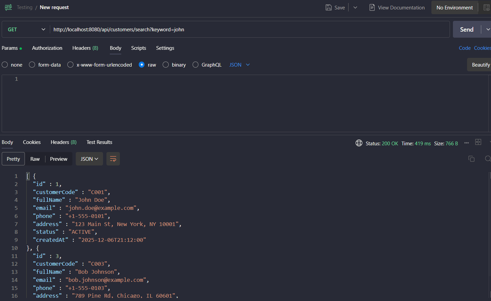

---

#### Task 5.2: Filter by Status (3 points)

Add endpoint to filter customers by status.

1. Client sent request: User sent **HTTP GET** request to the link /api/customers/status/ACTIVE or INACTIVE.
2. Controller: Recieve request and sent the value `ACTIVE/INACTIVE` from URL path and sent to Service.
```java
@GetMapping("/status/{status}")
public ResponseEntity<List<CustomerResponseDTO>> getCustomersByStatus(
        @PathVariable String status) {
    List<CustomerResponseDTO> customers = customerService.getCustomersByStatus(status);
    return ResponseEntity.ok(customers);
}
```
3. Service: Recieve status (`String`), then call Repository to find Entity match with the status. After that, change value Entity to DTO.
4. Respository: Automatically create SQL query to find the column Status(`ACTIVE/INACTIVE`) which match with user requirement.
5. Database: Sent back the statisfy data
6. Reponse: Controller sent the DTO list as JSON.

**Test:**
```
GET /api/customers/status/ACTIVE
GET /api/customers/status/INACTIVE
```
Result 1:   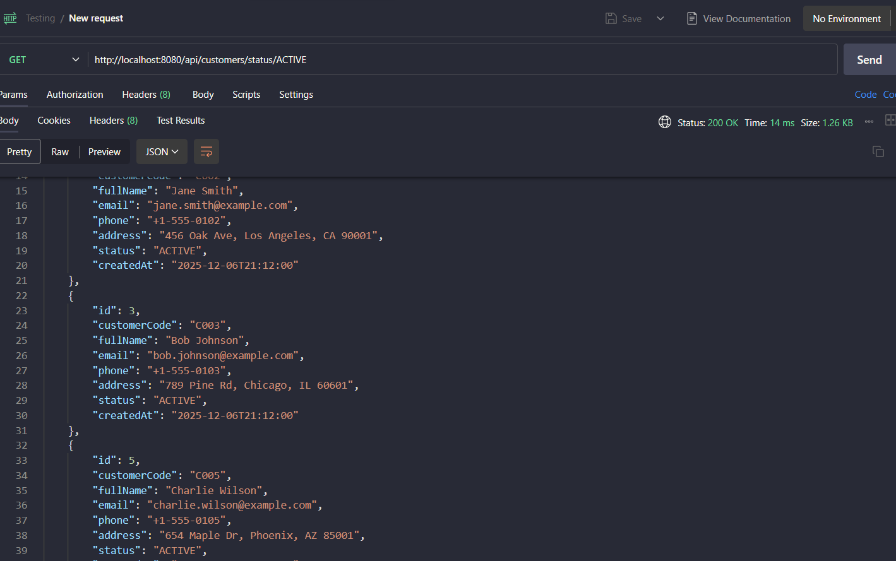
Result 2:   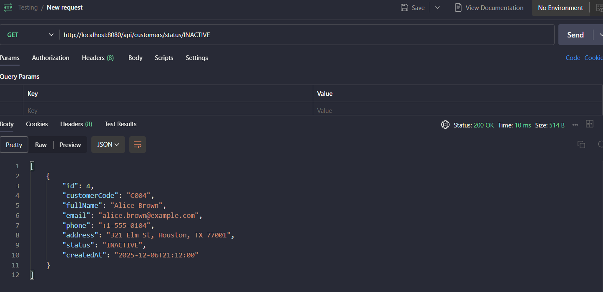

---

#### Task 5.3: Advanced Search with Multiple Criteria (3 points)

Create endpoint for searching with multiple optional parameters.

1. Client sent request: User sent **HTTP GET** request to /api/customers/advanced-search along with Query Parameters, Example: `?name=John&status=ACTIVE`.
2. Controller: Recieve request, extract parameters  `name`, `email`, `status` from URL. If user dont sent any parameter, that values become `null`.
3. Service: Recieve input parameters. If it have parameter `status` (String type), Service will change it into `Enum`. After that call Repository.
4. Repository: Execute the JPQL query (`@Query`) with special logic.
5. Database: filter data base on a compination of conditions (AND).
6. Reponse: Controller sent back the DTO list as JSON.

**Add to Controller:**
```java
@GetMapping("/advanced-search")
    public ResponseEntity<List<CustomerResponseDTO>> advancedSearch(
            @RequestParam(required = false) String name,
            @RequestParam(required = false) String email,
            @RequestParam(required = false) String status) {
        
        List<CustomerResponseDTO> customers = customerService.advancedSearch(name, email, status);
        return ResponseEntity.ok(customers);
    }
```

Test cases:
- Case 1: Search All
* Request: GET /api/customers/advanced-search
* Logic: name=null, email=null, status=null
* Query: TRUE AND TRUE AND TRUE -> return All list
**Result**: 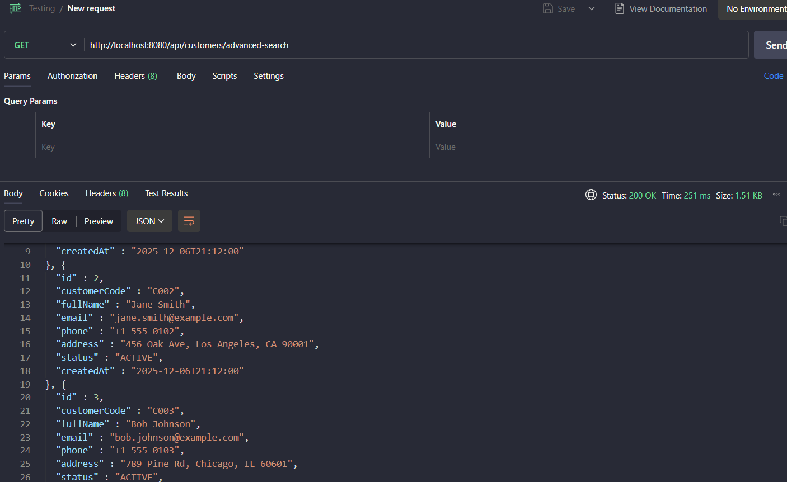

- Case 2: Search by Name
* Request: GET /api/customers/advanced-search?name=John
* Logic: name != null , filter by "John" and email, status = null
* Query: return any name relate to "John" 
**Result**: 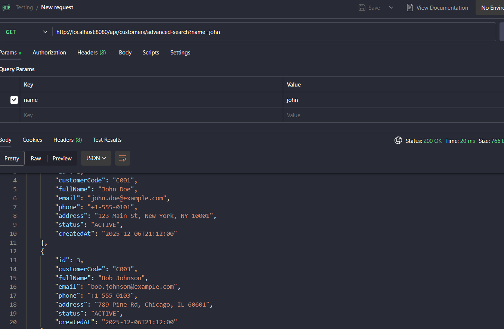

- Case 3: Search by Name and Status
* Request: GET /api/customers/advanced-search?name=John&status=ACTIVE
* Logic: Filter name "John, status "ACTIVE", email = null
* Query: Return any name have "John" and have status "ACITVE"
**Result**: 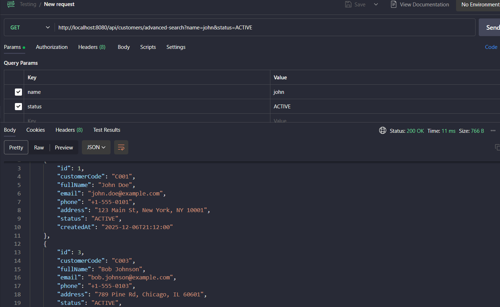

---

### EXERCISE 6: PAGINATION & SORTING (10 points)

**Estimated Time:** 40 minutes

#### Task 6.1: Add Pagination (5 points)

Implement pagination for customer list.

1. Client request: GET /api/customers?page=0&size=5
    - User want to see 'Page 1' and each page have `5 customers`
2. Controlller : Recieve `page = 0`, `size = 5` and sent that parameters to Service 
**Update Controller**
```java
@GetMapping
public ResponseEntity<Map<String, Object>> getAllCustomers(
        @RequestParam(defaultValue = "0") int page,
        @RequestParam(defaultValue = "10") int size) {
    
    Page<CustomerResponseDTO> customerPage = customerService.getAllCustomers(page, size);
    
    Map<String, Object> response = new HashMap<>();
    response.put("customers", customerPage.getContent());
    response.put("currentPage", customerPage.getNumber());
    response.put("totalItems", customerPage.getTotalElements());
    response.put("totalPages", customerPage.getTotalPages());
    
    return ResponseEntity.ok(response);
}
```
3. Service: `PageRequest.of(0, 5)` create a pagination request. Call `repository.findAll(pageable)`.
4. Repos and Database: execute 2 query: get data `LIMIT/OFFSET`, sum count `COUNT` (Calculate the number of people to set the pages).
5. Service (Mapping): Recieve `Page<Customer>` (include 5 Entity). Using `map()` to convert 5 Entity into DTO.
**ServiceImpl**
```java
    @Override
    public Page<CustomerResponseDTO> getAllCustomers(int page, int size) {
    // 1. Create a Pageable object from the page number and size.
    Pageable pageable = PageRequest.of(page, size);

    // 2. Call Repository to retrieve pagination data (Returns Page<Customer>)
    Page<Customer> customerPage = customerRepository.findAll(pageable);

    // 3. Convert Page<Entity> to Page<DTO>
    // The .map() function of the Page object is very powerful; it automatically iterates through each element.
    return customerPage.map(this::convertToResponseDTO);
    }
```


6. Controller (reponse): Controller sent back the DTO list as JSON.

**Update Service to use Pageable:**
```java
Page<CustomerResponseDTO> getAllCustomers(int page, int size);
```

**Test:**
```
GET /api/customers?page=0&size=5
GET /api/customers?page=1&size=10
```
Result:
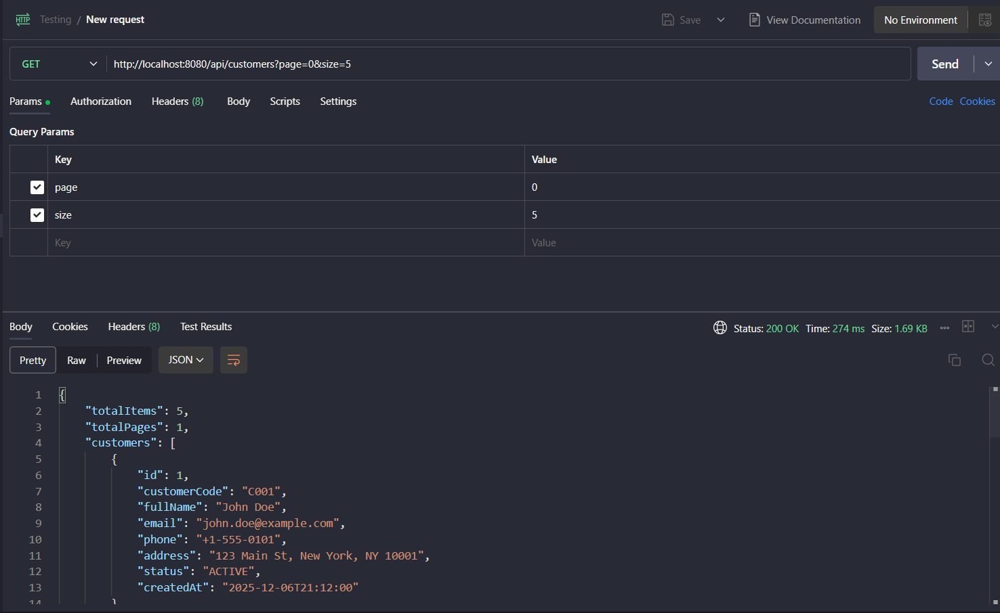
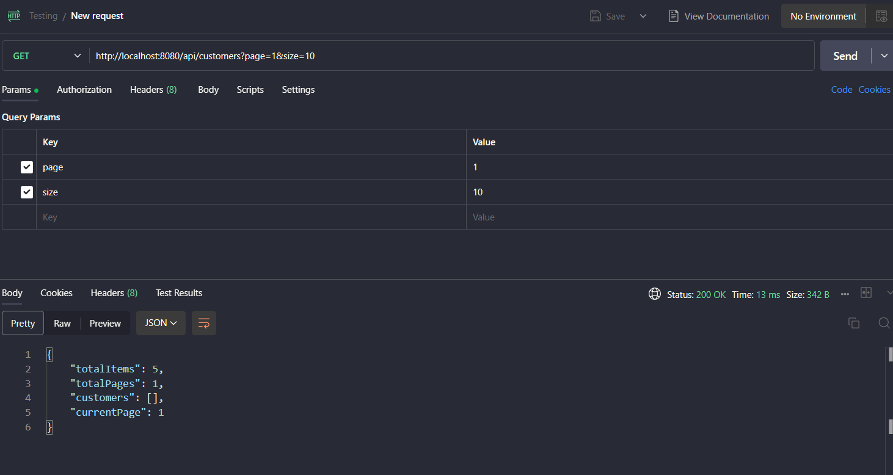

---

#### Task 6.2: Add Sorting (3 points)

Add sorting capability to customer list.
1. Client request: User sent **HTTP GET** request to `/api/customers` with **Query Parameters** like: `?sortBy=email&sortDir=asc`.
2. Controller: Receive request, and extract parameter `sortBy` (the columns need to sort) and `sortDir` (asc or desc). If user dont sent, the system will automatically sort by **id and asc**. This then creates a Sort object for Spring Data. 
**Update Controller:**
```java
 @GetMapping
    public ResponseEntity<List<CustomerResponseDTO>> getAllCustomers(
            @RequestParam(defaultValue = "id") String sortBy,
            @RequestParam(defaultValue = "asc") String sortDir) {
        
        // 1. Create a Sort object based on the parameters provided by the user.
        Sort sort = sortDir.equalsIgnoreCase("asc") 
            ? Sort.by(sortBy).ascending() 
            : Sort.by(sortBy).descending();

        // 2. Call the Service to retrieve the sorted data.
        List<CustomerResponseDTO> customers = customerService.getAllCustomers(sort);
        return ResponseEntity.ok(customers);
    }
```
3. Service: Recieve the `Sort object` from controller. Call Repository and pass this object in.
4. Repository and Database: The same execution, it automatically generates the corresponding SQL statement with the `ORDER BY` clause. Query data and sort results.
5. Reponse: Controller sent the DTO list with correctlly order as JSON.

**Test:**
```
GET /api/customers?sortBy=fullName&sortDir=asc
GET /api/customers?sortBy=createdAt&sortDir=desc
```
Result:
 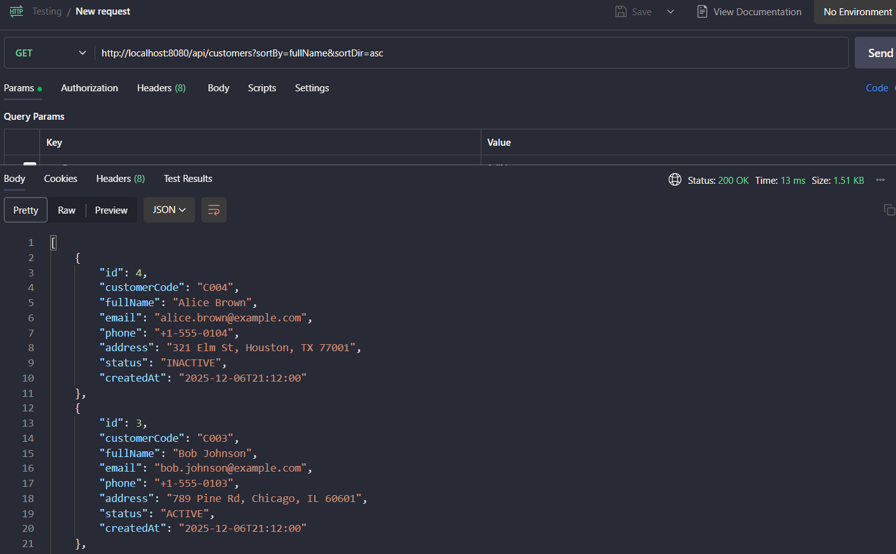
 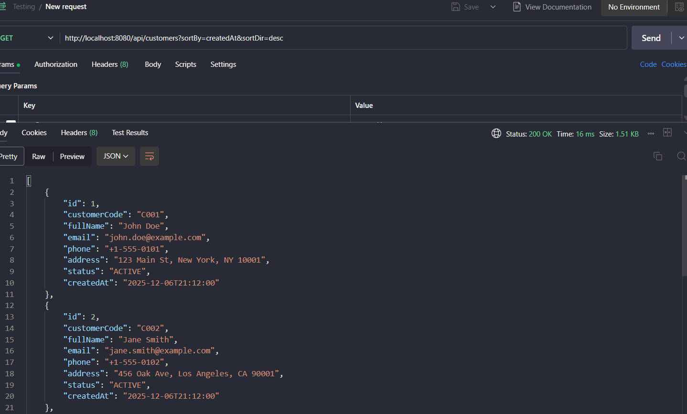

---

#### Task 6.3: Combine Pagination and Sorting (2 points)

Combine both features in one endpoint.

1. Client request: User sent **HTTP GET** request, contains both pagination and sorting information: e.g., `/api/customers?page=0&size=5&sortBy=fullName&sortDir=asc`.
2. Controller: Receive 4 parameters. Controller encapsulates `sortBy and sortDir` to **Sort** object. After that, it also do the same with `page, size, sort` and encapsulates to **Pageable**.
3. Service: Receive `Pageable object` and move it down to Repository.
4. Repository and Database: Do the same execution with task 6.1 and 6.2 .
5. Controller (Response): Controller return JSON object which contain data

**Updata Function**
```java
@GetMapping
    public ResponseEntity<Map<String, Object>> getAllCustomers(
            @RequestParam(defaultValue = "0") int page,
            @RequestParam(defaultValue = "10") int size,
            @RequestParam(defaultValue = "id") String sortBy,
            @RequestParam(defaultValue = "asc") String sortDir) {

        // 1. Create a Sort object (from Task 6.2)
        Sort sort = sortDir.equalsIgnoreCase("asc") 
                ? Sort.by(sortBy).ascending() 
                : Sort.by(sortBy).descending();

        // 2. Create a combined Pageable object (Page + Size + Sort)
        Pageable pageable = PageRequest.of(page, size, sort);

        // 3. Call Service
        Page<CustomerResponseDTO> customerPage = customerService.getAllCustomers(pageable);

        // 4. Package the results (from Task 6.1)
        Map<String, Object> response = new HashMap<>();
        response.put("customers", customerPage.getContent());
        response.put("currentPage", customerPage.getNumber());
        response.put("totalItems", customerPage.getTotalElements());
        response.put("totalPages", customerPage.getTotalPages());
        response.put("sortBy", sortBy); // Additional information to let the client know what they are sorting by.

        return ResponseEntity.ok(response);
    }
```

**Test:**
```
GET /api/customers?page=0&size=5&sortBy=fullName&sortDir=asc
```
Result: 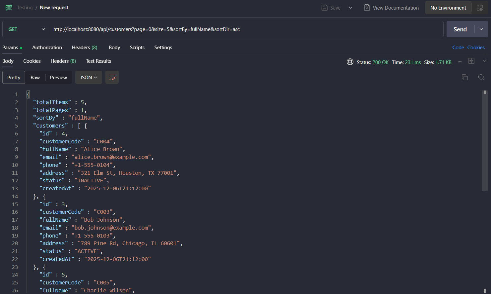

---

### EXERCISE 7: PARTIAL UPDATE WITH PATCH (10 points)

**Estimated Time:** 35 minutes

#### Task 7.1: Create Update DTO (3 points)

**File:** `CustomerUpdateDTO.java`
```java
package com.example.customer_api.dto;

public class CustomerUpdateDTO {
    private String fullName;
    private String email;
    private String phone;
    private String address;
    
    public CustomerUpdateDTO() {
    }

    public CustomerUpdateDTO(String fullName, String email, String phone, String address) {
        this.fullName = fullName;
        this.email = email;
        this.phone = phone;
        this.address = address;
    }

    // Gettter and Setter
    //....
}
```

---

#### Task 7.2: Implement PATCH Endpoint (5 points)

**Add to Controller:**
```java
@PatchMapping("/{id}")
public ResponseEntity<CustomerResponseDTO> partialUpdateCustomer(
        @PathVariable Long id,
        @RequestBody CustomerUpdateDTO updateDTO) {
    
    CustomerResponseDTO updated = customerService.partialUpdateCustomer(id, updateDTO);
    return ResponseEntity.ok(updated);
}
```

**Add to Service:**
```java
    @Override
    public CustomerResponseDTO partialUpdateCustomer(Long id, CustomerUpdateDTO updateDTO) {
    
    // Fetch existing customer
    Customer customer = customerRepository.findById(id)
        .orElseThrow(() -> new ResourceNotFoundException("Customer not found"));
    
    // Only update non-null fields
    if (updateDTO.getFullName() != null) {
        customer.setFullName(updateDTO.getFullName());
    }
    if (updateDTO.getEmail() != null) {
        customer.setEmail(updateDTO.getEmail());
    }

    if (updateDTO.getPhone() != null) {
        customer.setPhone(updateDTO.getPhone());
    }
    
    if (updateDTO.getAddress() != null) {
        customer.setAddress(updateDTO.getAddress());
    }
    
    // Save and update customer
    return convertToResponseDTO(customerRepository.save(customer));
    }

```

---

#### Task 7.3: Test PATCH vs PUT (2 points)
**Flow**:
1. PUT (Update all informaiton):
    - Client sent: {"fullName": "New Name"} and dismiss email, address 
    - Sever uderstant: "Email and Address is null".
    - Result: Name is become "New Name", Email and Address become dont have information( or error validation)
2. PATCH (Update a part)
    - Client sent: {"fullName": "New Name"}
    - Sever logic (task 7.2): Only have `fullName` != null. Update `fullName` and keep all old informaiton.
    - Result: Only change name. 

**Test cases:**
```
PUT /api/customers/1
{
    "customerCode": "C001",
    "fullName": "John Updated",
    "email": "john.updated@example.com",
    "phone": "+1-555-9999",
    "address": "New Address"
}

PATCH /api/customers/1
{
    "fullName": "John Partially Updated"
}
```
Result:
PUT: 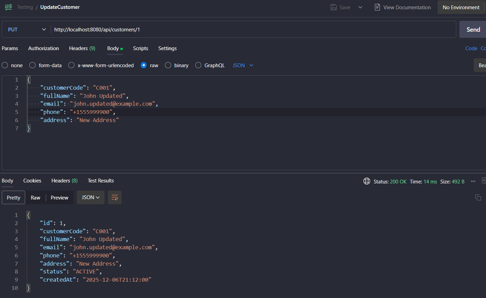
PATCH: 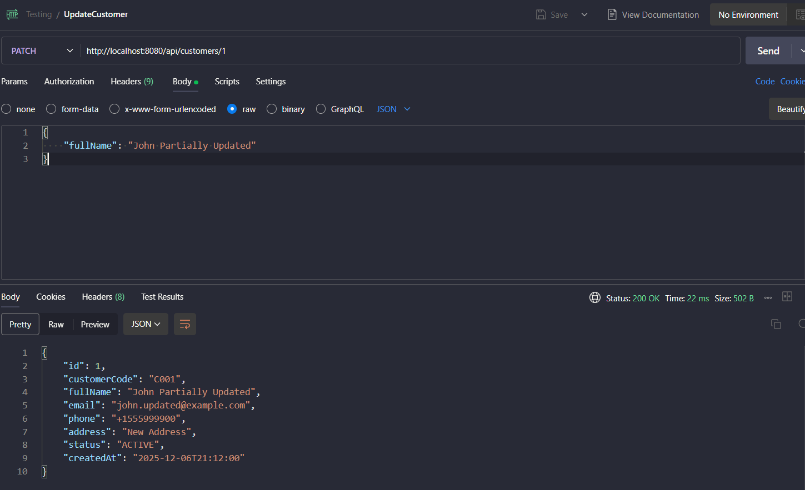

---

### EXERCISE 8: API DOCUMENTATION (8 points)

**Estimated Time:** 30 minutes

#### Task 8.1: Create Postman Collection (4 points)

Create a Postman collection with all endpoints:
1. GET all customers
2. GET customer by ID
3. POST create customer
4. PUT update customer
5. PATCH partial update
6. DELETE customer
7. Search customers
8. Filter by status

**Save as:** `Customer_API.postman_collection.json`

- I cant Export the data in postman, so i wrote the file Customer_API.txt instead
[Customer API](Customer_API.txt)

---

#### Task 8.2: Document API Responses (2 points)

Create `API_DOCUMENTATION.md` file:

```markdown
# Customer API Documentation

## Base URL
`http://localhost:8080/api/customers`

## Endpoints

### 1. Get All Customers
**GET** `/api/customers`

**Response:** 200 OK
```json
[
    {
        "id": 1,
        "customerCode": "C001",
        ...
    }
]
```

### 2. Get Customer by ID
**GET** `/api/customers/{id}`

**Response:** 200 OK
...

### Error Responses

**404 Not Found**
```json
{
    "timestamp": "2024-11-03T10:00:00",
    "status": 404,
    ...
}
```

---

#### Task 8.3: Add Examples for Each Status Code (2 points)

Document examples for:
- 200 OK
- 201 Created
- 400 Bad Request (validation)
- 404 Not Found
- 409 Conflict (duplicate)
- 500 Internal Server Error

---
[API Documentation](API_Documentation.md)

## BONUS EXERCISES (Optional - Extra Credit)

**Not required, earn up to 20 bonus points**

### BONUS 1: API Versioning (6 points)

Implement API versioning.

**Create v1 and v2 controllers:**
```java
@RestController
@RequestMapping("/api/v1/customers")
public class CustomerRestControllerV1 {
    // Original implementation
}

@RestController
@RequestMapping("/api/v2/customers")
public class CustomerRestControllerV2 {
    // Enhanced version with new fields
}
```

Result:
 - V1: 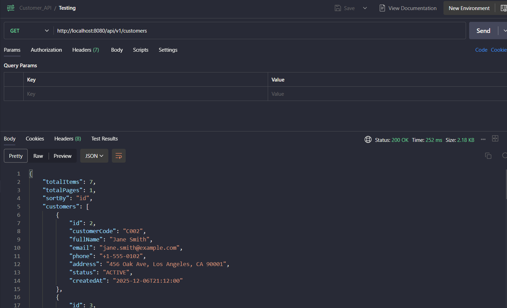
 - V2: 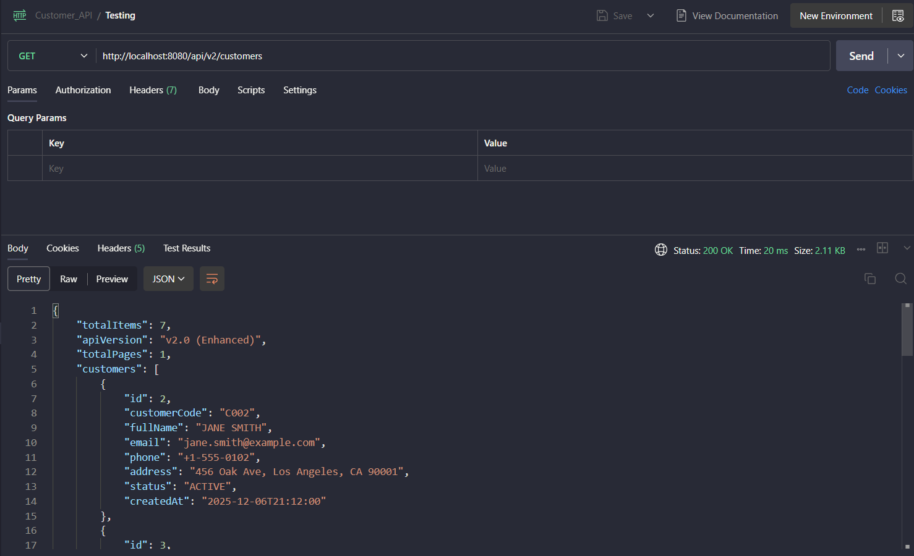


---

### BONUS 2: HATEOAS Links (7 points)

Add hypermedia links to responses.

**Add dependency:**
```xml
<dependency>
    <groupId>org.springframework.boot</groupId>
    <artifactId>spring-boot-starter-hateoas</artifactId>
</dependency>
```

**Update Response DTO:**
```java
import org.springframework.hateoas.RepresentationModel;

public class CustomerResponseDTO extends RepresentationModel<CustomerResponseDTO> {
    // ... fields
}
```

**Add links in controller:**
```java
@GetMapping("/{id}")
public ResponseEntity<CustomerResponseDTO> getCustomerById(@PathVariable Long id) {
    CustomerResponseDTO customer = customerService.getCustomerById(id);
    
    customer.add(linkTo(methodOn(CustomerRestController.class).getCustomerById(id)).withSelfRel());
    customer.add(linkTo(methodOn(CustomerRestController.class).getAllCustomers()).withRel("all-customers"));
    
    return ResponseEntity.ok(customer);
}
```

Result:
    - 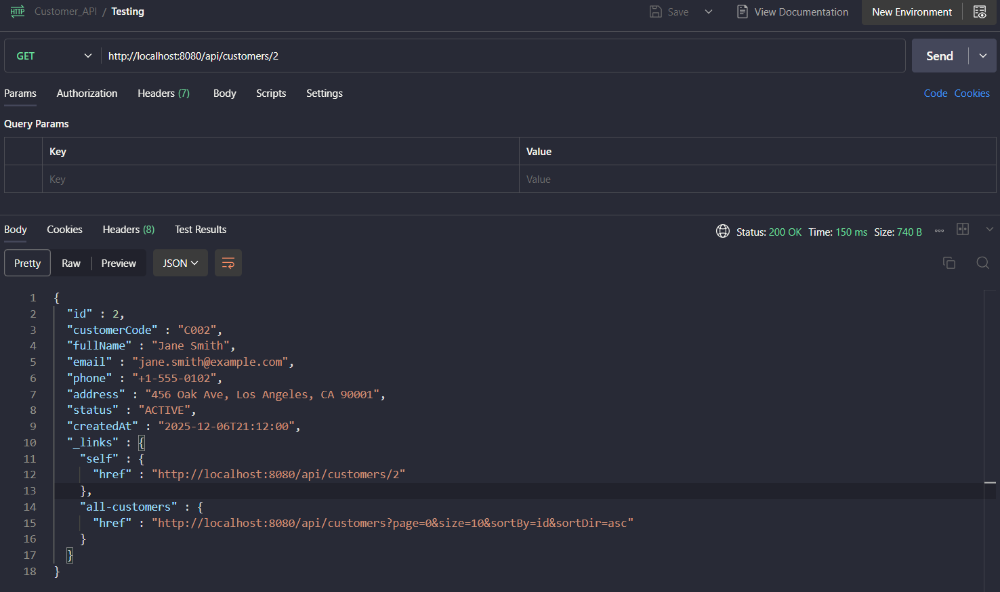

**Response with links:**
```json
{
    "id": 1,
    "customerCode": "C001",
    "fullName": "John Doe",
    "_links": {
        "self": {
            "href": "http://localhost:8080/api/customers/1"
        },
        "all-customers": {
            "href": "http://localhost:8080/api/customers"
        }
    }
}
```

---

### BONUS 3: Rate Limiting (7 points)

Implement rate limiting for API endpoints.

**Add Bucket4j dependency:**
```xml
<dependency>
	<groupId>com.bucket4j</groupId> <artifactId>bucket4j-core</artifactId>
	<version>8.1.0</version>
</dependency>

```

**Create rate limiting interceptor:**
```java
@Component
public class RateLimitInterceptor implements HandlerInterceptor {
    
     private final Map<String, Bucket> cache = new ConcurrentHashMap<>();
    
    @Override
    public boolean preHandle(HttpServletRequest request, 
                             HttpServletResponse response, 
                             Object handler) throws Exception {
        
        String key = request.getRemoteAddr();// Identify user by IP address

        // Get or create a bucket for this IP
        Bucket bucket = cache.computeIfAbsent(key, k -> createNewBucket());
        
        // Try to consume 1 token
        if (bucket.tryConsume(1)) {
            return true; //Success, proceed to Controller
        }
        
        response.setStatus(429);
        response.getWriter().write("Too many requests");
        return false;
    }
    
    private Bucket createNewBucket() {
        
    // Rule: 100 requests allowed per 1 minute
    return Bucket.builder()
        .addLimit(Bandwidth.simple(2, Duration.ofMinutes(1)))
        .build();
    }

}
```
Result:
- 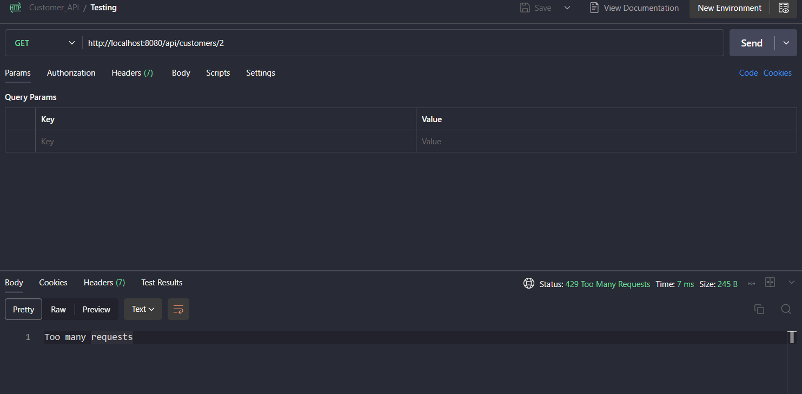