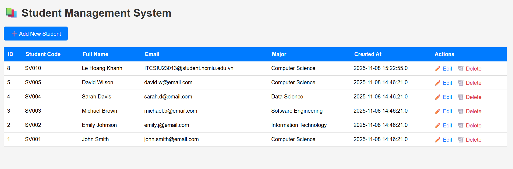

# LAB 4 EXERCISES: JSP + MYSQL - CRUD OPERATIONS

**Course:** Web Application Development  
**Lab Duration:** 2.5 hours  
**Total Points:** 100 points (In-class: 60 points, Homework: 40 points)

> Name: Le Hoang Khanh
> ID: ITCSIU23013
> Tutor: Nguyen Trung Nghia
---
# PART A: IN-CLASS EXERCISES (60 points)

### EXERCISE 1: SETUP AND DISPLAY (15 points)

**Task 1.1: Project Setup (5 points)**

**Result** 
---

**Task 1.2: Display Student List (10 points)**

**Result** 
---

### EXERCISE 2: CREATE OPERATION (15 points)

**Task 2.1: Create Add Student Form (5 points)**

> When click on the add button it link to the add_student.jsp

**Result** 
---

**Task 2.2: Process Add Student (10 points)**

> When click on submit button it will execute the process_add.jsp and process_add file only has java code, therefore it not display
> All the error of user input will be handle in process_add.jsp and present on the add_student.jsp
> Then successfull go to the list_student page

**Result** 
---

### EXERCISE 3: UPDATE OPERATION (15 points)

**Task 3.1: Create Edit Form (7 points)**

> Click on update button action edit_student is call move to that jsp file with form already load data from database
> Then edit 

**Result** 
---

**Task 3.2: Process Update (8 points)**

> The same to add_process

**Result** 
---

### EXERCISE 4: DELETE OPERATION (15 points)

**Task 4.1: Implement Delete (10 points)**

**Result** 
---

**Task 4.2: Add Delete Links and Confirmation (5 points)**